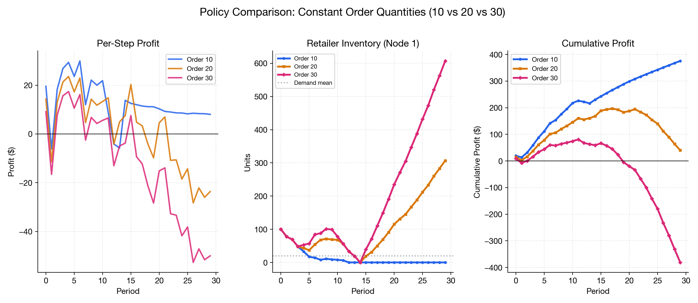
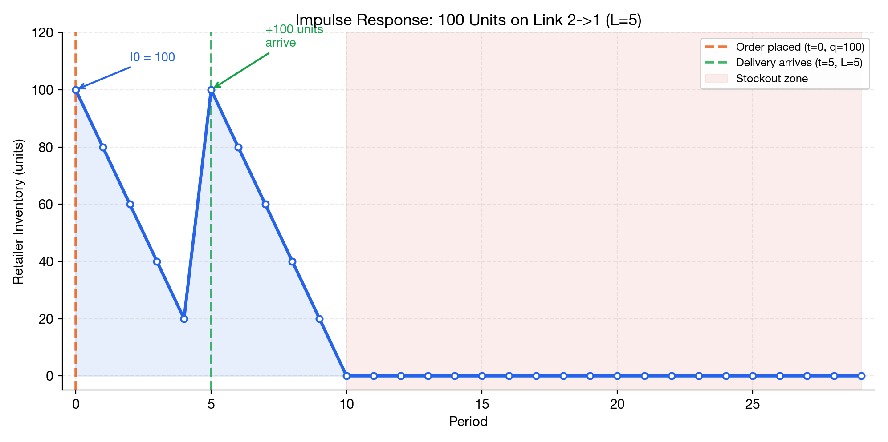
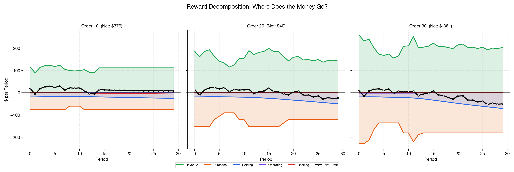
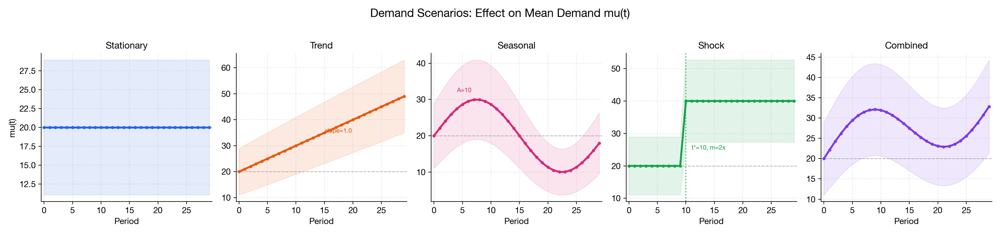
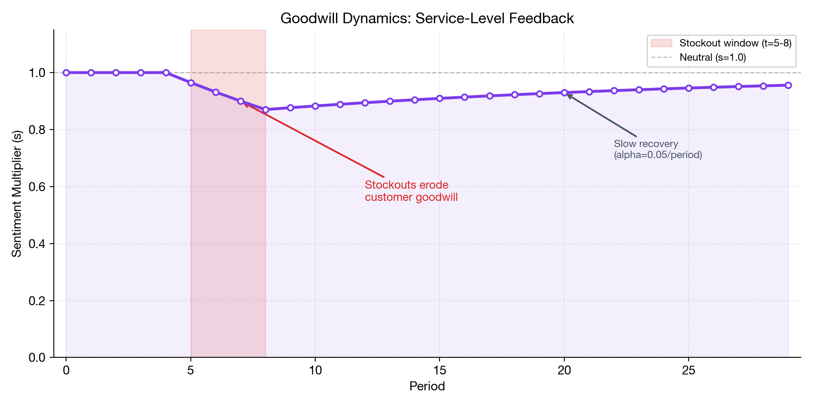

# Tutorial: Understanding Multi-Echelon Inventory Management

A step-by-step guide to the inventory management problem, from first principles to running experiments with `gym-invmgmt`.

> **Prerequisites**: `pip install -U gym-invmgmt matplotlib numpy`

---

## Table of Contents

1. [The Problem: Why Inventory Management is Hard](#1-the-problem)
2. [Exploring the Network](#2-exploring-the-network)
3. [Understanding a Single Step](#3-understanding-a-single-step)
4. [Experiment 1: Constant Order Policy](#4-experiment-1-constant-order-policy)
5. [Experiment 2: Validating Lead Time Physics](#5-experiment-2-lead-time-physics)
6. [Experiment 3: Reward Function Breakdown](#6-experiment-3-reward-breakdown)
7. [Experiment 4: Demand Scenarios](#7-experiment-4-demand-scenarios)
8. [Experiment 5: The Bullwhip Effect](#8-experiment-5-bullwhip-effect)
9. [Experiment 6: Goodwill Dynamics](#9-experiment-6-goodwill-dynamics)
10. [Configuration Cookbook](#10-configuration-cookbook)

---

## 1. The Problem

### Why is Inventory Management Hard?

Every supply chain manager faces a fundamental tradeoff:

$$
\text{Order too much} \implies \text{high holding costs} \qquad \text{Order too little} \implies \text{lost sales + penalties}
$$

In a **multi-echelon** network, this problem multiplies — decisions at one node ripple through the entire chain via **lead times** (delays between order and delivery).

### The Core Decision

At each time period $t$, you decide: **how much to order** on each supply link.

Your goal: **maximize total profit** over $T$ periods:

$$
\max \sum_{t=0}^{T-1} \sum_{j \in \mathcal{N}} \left[ \text{Revenue}_j - \text{Purchasing Cost}_j - \text{Holding Cost}_j - \text{Operating Cost}_j - \text{Backlog Penalty}_j \right]
$$

This is hard because:
- **Demand is stochastic** — you don't know exactly how much customers will buy
- **Lead times are long** — orders placed today arrive 5–12 steps later
- **Nodes share suppliers** — factories have limited capacity across multiple buyers
- **Costs compound** — holding excess inventory is expensive, but stockouts are worse

---

## 2. Exploring the Network

Let's start by looking at what we're managing.

### 2.1 Create the Environment

```python
import gymnasium as gym
import gym_invmgmt
import numpy as np
import matplotlib.pyplot as plt

# Create the multi-echelon environment
env = gym_invmgmt.CoreEnv(scenario='network')
obs, info = env.reset(seed=42)

print(f"Network has {env.network.num_nodes} nodes")
print(f"You control {env.action_space.shape[0]} order decisions per step")
print(f"You observe {env.observation_space.shape[0]} state features")
print(f"Episode length: {env.num_periods} periods")
```

### 2.2 Visualize the Topology

```python
# Simple view — just the structure
env.plot_network()
```

```python
# Detailed view — all parameters (costs, lead times, capacities)
env.plot_network(detailed=True)
```

### 2.3 Understanding the Nodes

| Node Type | Role | Key Properties |
|---|---|---|
| **Raw Material** (7, 8) | Unlimited supply source | No constraints |
| **Factory** (4, 5, 6) | Produces goods | Capacity $C$, operating cost $o$, yield $v$ |
| **Distributor** (2, 3) | Intermediate storage | Holding cost $h$ |
| **Retailer** (1) | Sells to customers | Holding cost $h$, faces random demand |
| **Market** (0) | Demand sink | Generates Poisson demand $D_t \sim \text{Poi}(20)$ |

### 2.4 Understanding the Edges

Each supply link $(i \to j)$ has:
- **Lead time** $L_{ij}$: Orders take $L$ periods to arrive (e.g., $L=8$ means 8 steps of delay)
- **Price** $p_{ij}$: Cost per unit ordered
- **Pipeline holding cost** $g_{ij}$: Cost per unit in transit per period

The **total pipeline inventory** in the system is the sum of all orders that have been placed but haven't arrived yet. With lead times up to 12, this is a lot of "invisible" inventory!

---

## 3. Understanding a Single Step

Let's manually walk through one step to see exactly what happens.

### 3.1 The Step Sequence

```python
env = gym_invmgmt.CoreEnv(scenario='network')
obs, info = env.reset(seed=42)

# Let's order 20 units on every link
# Note: 20 is a small value for this demo. The raw action space upper bound is much
# larger (init_inv_max + capacity_max * T). For RL training, wrap with RescaleAction
# to normalize actions to [-1, 1] — see the Wrappers section in the README.
action = np.ones(env.action_space.shape[0]) * 20

# Take one step
obs_next, reward, terminated, truncated, info = env.step(action)

print(f"Reward (profit): ${reward:.2f}")
print(f"Total inventory: {info['total_inventory']:.0f} units")
print(f"Total backlog: {info['total_backlog']:.0f} units")
print(f"Goodwill sentiment: {info['sentiment']:.3f}")
```

### 3.2 What Just Happened?

The sequence within each step is:

| Phase | What Happens | Math |
|---|---|---|
| **1. Orders** | Each node orders from its suppliers | $R_t^{(e)} = \min(a_t^{(e)}, \text{available})$ |
| **2. Deliveries** | Orders from $L$ periods ago arrive | $X_{t+1}^{(j)} = X_t^{(j)} + \text{incoming} - \text{outgoing}$ |
| **3. Demand** | Customers buy at retail | $D_t \sim \text{Poisson}(\mu_t)$ |
| **4. Profit** | Revenue minus all costs | $r_t = \sum_j (\text{SR} - \text{PC} - \text{HC} - \text{OC} - \text{UP})$ |

### 3.3 Reading the Observation

```python
env = gym_invmgmt.CoreEnv(scenario='network')
obs, info = env.reset(seed=42)

# The observation vector has 70 components:
n_retail = len(env.network.retail_links)       # 1: demand
n_main = len(env.network.main_nodes)            # 7: inventory
n_pipeline = env.network.pipeline_length        # 60: pipeline
n_extra = env.extra_features_dim                # 2: time + sentiment

print(f"Observation breakdown:")
print(f"  Demand:    obs[0:{n_retail}]         = {obs[:n_retail]}")
print(f"  Inventory: obs[{n_retail}:{n_retail+n_main}]       = {obs[n_retail:n_retail+n_main]}")
print(f"  Pipeline:  obs[{n_retail+n_main}:{n_retail+n_main+n_pipeline}]  = ({n_pipeline} values)")
print(f"  Features:  obs[{n_retail+n_main+n_pipeline}:]       = {obs[n_retail+n_main+n_pipeline:]}")
```

---

## 4. Experiment 1: Constant Order Policy

The simplest policy: order the same amount on every link at every step.

### 4.1 Run the Simulation

```python
env = gym_invmgmt.CoreEnv(scenario='network')
obs, info = env.reset(seed=42)

# Track metrics
rewards = []
inventories = []
backlogs = []

for t in range(env.num_periods):
    # Constant policy: order 20 units on every link
    action = np.ones(env.action_space.shape[0]) * 20
    obs, reward, terminated, truncated, info = env.step(action)

    rewards.append(reward)
    # Track retailer inventory (node 1)
    retailer_idx = env.network.node_map[1]
    inventories.append(env.X[t+1, retailer_idx])
    backlogs.append(info['total_backlog'])

total_profit = sum(rewards)
print(f"Total profit: ${total_profit:.2f}")
print(f"Average step profit: ${np.mean(rewards):.2f}")
print(f"Max backlog: {max(backlogs):.0f} units")
```

### 4.2 Visualize the Results

```python
fig, axes = plt.subplots(3, 1, figsize=(12, 10), sharex=True)

# Reward per step
axes[0].bar(range(1, 31), rewards, color='steelblue', alpha=0.7)
axes[0].axhline(np.mean(rewards), color='red', linestyle='--', label=f'Mean: ${np.mean(rewards):.2f}')
axes[0].set_ylabel('Profit ($)')
axes[0].set_title('Step-by-Step Profit (Constant Order = 20)')
axes[0].legend()
axes[0].grid(True, alpha=0.3)

# Retailer inventory
axes[1].plot(range(1, 31), inventories, 'o-', color='green', markersize=4)
axes[1].axhline(0, color='red', linewidth=2)
axes[1].set_ylabel('Retailer Inventory')
axes[1].set_title('Retailer (Node 1) On-Hand Inventory')
axes[1].grid(True, alpha=0.3)

# Backlog
axes[2].fill_between(range(1, 31), backlogs, color='red', alpha=0.3)
axes[2].plot(range(1, 31), backlogs, 'o-', color='red', markersize=4)
axes[2].set_ylabel('Unfulfilled Demand')
axes[2].set_xlabel('Time Period')
axes[2].set_title('Total System Backlog')
axes[2].grid(True, alpha=0.3)

plt.tight_layout()
plt.savefig('constant_policy_results.png', dpi=150, bbox_inches='tight')
plt.show()
```



### 4.3 Discussion

**Why does profit fluctuate?** Even with a constant order policy, demand is stochastic ($D_t \sim \text{Poi}(20)$). Some periods demand exceeds supply at the retailer → backlog penalty. Other periods demand is low → excess holding cost.

**Key insight**: The constant policy doesn't account for lead times. Orders placed at $t=0$ on a link with $L=8$ don't arrive until $t=8$. By then, the retailer may be out of stock.

---

## 5. Experiment 2: Lead Time Physics

The most important physical constraint in the environment: **orders don't arrive instantly**. Let's verify this.

### 5.1 Impulse Response Test

We order 100 units on a single link at $t=0$ and nothing afterwards. The delivery should arrive exactly after $L$ periods.

```python
env = gym_invmgmt.CoreEnv(scenario='network',
    demand_config={'type': 'stationary', 'base_mu': 0, 'noise_scale': 0.0})

obs, info = env.reset(seed=42)

# Track the pipeline and inventory for link (2→1), L=5
target_link_idx = env.network.reorder_map[(2, 1)]  # Distributor→Retailer
retailer_idx = env.network.node_map[1]
L = env.network.lead_times[(2, 1)]

history_pipeline = []
history_inventory = []
steps = 15

for t in range(steps):
    action = np.zeros(env.action_space.shape[0])
    if t == 0:
        action[target_link_idx] = 100  # Impulse: 100 units at t=0
    obs, reward, term, trunc, info = env.step(action)

    history_pipeline.append(env.Y[t+1, target_link_idx])
    history_inventory.append(env.X[t+1, retailer_idx])

# Plot
fig, ax = plt.subplots(figsize=(12, 5))
x = range(1, steps + 1)
ax.plot(x, history_pipeline, 'o--', color='tab:blue', label='Pipeline (in transit)')
ax.plot(x, history_inventory, 's-', linewidth=2, color='tab:orange', label='Retailer inventory')
ax.axvline(x=1 + L, color='red', linestyle=':', linewidth=2,
           label=f'Expected arrival (L={L})')
ax.set_xlabel('Time Step')
ax.set_ylabel('Units')
ax.set_title(f'Impulse Response: 100 units ordered at t=0, Lead Time L={L}')
ax.set_xticks(range(1, steps + 1))
ax.legend()
ax.grid(True, alpha=0.3)
plt.savefig('impulse_response.png', dpi=150, bbox_inches='tight')
plt.show()
```



### 5.2 What to Expect

- **Pipeline** (blue dashed): Should be 100 from $t=1$ to $t=L$, then drop to 0
- **Inventory** (orange solid): Should jump from 0 to 100 at exactly $t = L + 1$

This confirms the lead-time physics are correct. The implication for ordering decisions: **you must plan $L$ steps ahead**.

---

## 6. Experiment 3: Reward Breakdown

Let's decompose the reward into its components to understand what drives profitability.

### 6.1 Run with Random Actions

```python
env = gym_invmgmt.CoreEnv(scenario='network')
obs, info = env.reset(seed=42)

# Track reward components at the retailer
revenues, holding_costs, backlog_penalties, net_rewards = [], [], [], []

for t in range(20):
    action = env.action_space.sample()
    obs, reward, term, trunc, info = env.step(action)

    # Manually extract retailer (node 1) components
    retailer_idx = env.network.node_map[1]
    market_link = (1, 0)
    net_idx = env.network.network_map[market_link]

    # Revenue = Sales × Price
    rev = env.network.graph.edges[market_link]['p'] * env.S[t, net_idx]

    # Holding Cost = Inventory × h
    hold = env.network.graph.nodes[1]['h'] * env.X[t+1, retailer_idx]

    # Backlog Penalty = Unfulfilled × b
    retail_link_idx = env.network.retail_map[market_link]
    back = env.network.graph.edges[market_link]['b'] * env.U[t, retail_link_idx]

    revenues.append(rev)
    holding_costs.append(-hold)
    backlog_penalties.append(-back)
    net_rewards.append(reward)

# Plot
fig, ax = plt.subplots(figsize=(14, 6))
x = range(1, 21)

ax.bar(x, revenues, color='#2ecc71', alpha=0.7, label='Retailer Revenue')
ax.bar(x, holding_costs, color='#f39c12', alpha=0.7, label='Retailer Holding Cost')
ax.bar(x, backlog_penalties, color='#e74c3c', alpha=0.7,
       bottom=holding_costs, label='Retailer Backlog Penalty')
ax.plot(x, net_rewards, 'k-o', linewidth=2, markersize=5, label='Net System Reward')
ax.axhline(0, color='black', linewidth=0.8)

ax.set_xlabel('Time Step')
ax.set_ylabel('Dollars ($)')
ax.set_title('Reward Function Breakdown: Revenue vs Costs')
ax.legend(loc='upper right')
ax.grid(True, alpha=0.3)
plt.savefig('reward_breakdown.png', dpi=150, bbox_inches='tight')
plt.show()
```



### 6.2 Key Observations

- **Green bars (Revenue)**: Proportional to sales — bounded by demand and available inventory
- **Orange bars (Holding Cost)**: Grows with excess inventory — ordering too much wastes money
- **Red bars (Backlog Penalty)**: Appears when demand exceeds supply — ordering too little is costly
- **Black line (Net Reward)**: Includes ALL nodes, not just the retailer

The tradeoff is visible: high inventory → low backlog but high holding cost. Low inventory → low holding cost but potential backlog.

---

## 7. Experiment 4: Demand Scenarios

The `DemandEngine` supports composable non-stationary patterns. Let's compare them.

### 7.1 Visualize Different Demand Profiles

```python
from gym_invmgmt import CoreEnv

scenarios = {
    'Stationary': {'type': 'stationary', 'base_mu': 20},
    'Trend': {'type': 'trend', 'base_mu': 20, 'trend_slope': 0.05},
    'Seasonal': {'type': 'seasonal', 'base_mu': 20,
                 'seasonal_amp': 0.5, 'seasonal_freq': 2*np.pi/30},
    'Shock (t=15)': {'type': 'shock', 'base_mu': 20,
                     'shock_time': 15, 'shock_mag': 2.0},
    'Trend + Seasonal': {'effects': ['trend', 'seasonal'], 'base_mu': 20,
                         'trend_slope': 0.03, 'seasonal_amp': 0.4},
}

fig, axes = plt.subplots(len(scenarios), 1, figsize=(14, 3*len(scenarios)), sharex=True)

for ax, (name, config) in zip(axes, scenarios.items()):
    env = CoreEnv(scenario='network', demand_config=config, num_periods=30)
    obs, _ = env.reset(seed=42)

    demands = []
    for t in range(30):
        action = np.ones(env.action_space.shape[0]) * 20
        obs, reward, term, trunc, info = env.step(action)
        retail_link_idx = env.network.retail_map[(1, 0)]
        demands.append(env.D[t, retail_link_idx])

    mu_values = [env.demand_engine.get_current_mu(t) for t in range(30)]

    ax.bar(range(1, 31), demands, color='steelblue', alpha=0.6, label='Realized demand')
    ax.plot(range(1, 31), mu_values, 'r-', linewidth=2, label='Expected μ(t)')
    ax.set_ylabel('Demand')
    ax.set_title(name)
    ax.legend(loc='upper left', fontsize='small')
    ax.grid(True, alpha=0.3)

axes[-1].set_xlabel('Time Period')
plt.suptitle('Demand Scenario Comparison', fontsize=14, fontweight='bold', y=1.01)
plt.tight_layout()
plt.savefig('demand_scenarios.png', dpi=150, bbox_inches='tight')
plt.show()
```



### 7.2 Demand Math

Each scenario modifies the base mean $\mu_0 = 20$:

| Scenario | Formula | Effect |
|---|---|---|
| **Stationary** | $\mu_t = \mu_0 = 20$ | Constant mean, Poisson noise |
| **Trend** | $\mu_t = \mu_0 (1 + 0.05t)$ | Grows from 20 → 49 over 30 periods |
| **Seasonal** | $\mu_t = \mu_0 (1 + 0.5 \sin(\frac{2\pi}{30}t))$ | Oscillates between 10 and 30 |
| **Shock** | $\mu_t = \mu_0 \times 2.0$ for $t \geq 15$ | Demand doubles at period 15 |
| **Combined** | $\mu_t = \mu_0 (1 + 0.03t)(1 + 0.4\sin(\omega t))$ | Both effects simultaneously |

---

## 8. Experiment 5: The Bullwhip Effect

A classic supply chain phenomenon: small demand fluctuations at the retail level get **amplified** as they propagate upstream through the network.

### 8.1 Observe Order Amplification

```python
from gym_invmgmt import CoreEnv, EpisodeLoggerWrapper
import tempfile, os

with tempfile.TemporaryDirectory() as tmpdir:
    env = CoreEnv(scenario='network')
    env = EpisodeLoggerWrapper(env, log_dir=tmpdir, run_name='bullwhip')
    obs, _ = env.reset(seed=42)

    # Simple reactive policy: order = recent demand estimate
    for t in range(30):
        action = np.ones(env.action_space.shape[0]) * 20
        obs, reward, term, trunc, info = env.step(action)

    # Load trajectory
    files = [f for f in os.listdir(tmpdir) if f.endswith('.npz')]
    data = np.load(os.path.join(tmpdir, files[0]))

    # Plot orders across different echelons
    fig, ax = plt.subplots(figsize=(14, 6))

    # Retail demand
    ax.plot(range(1, 31), data['demand_D'][:, 0], 'k-o', linewidth=2,
            markersize=4, label='Customer Demand (retail)')

    # Orders at different echelon links
    labels = ['Dist 2→Retail 1', 'Factory 4→Dist 2', 'Raw 7→Factory 4']
    colors = ['#3498db', '#2ecc71', '#f39c12']

    for i, (label, color) in enumerate(zip(labels[:min(3, data['orders_R'].shape[1])],
                                            colors)):
        ax.plot(range(1, 31), data['orders_R'][:, i], '-s',
                color=color, markersize=3, label=f'Orders: {label}')

    ax.set_xlabel('Time Period')
    ax.set_ylabel('Units')
    ax.set_title('Bullwhip Effect: Order Variance Amplification Across Echelons')
    ax.legend()
    ax.grid(True, alpha=0.3)
    plt.savefig('bullwhip_effect.png', dpi=150, bbox_inches='tight')
    plt.show()

    # Compute variance ratios
    demand_var = np.var(data['demand_D'][:, 0])
    for i in range(min(3, data['orders_R'].shape[1])):
        order_var = np.var(data['orders_R'][:, i])
        ratio = order_var / demand_var if demand_var > 0 else 0
        print(f"Link {i}: Order variance / Demand variance = {ratio:.2f}x")
```

### 8.2 Why It Matters

The bullwhip effect means:
- Factories see wildly variable orders even when customer demand is stable
- This leads to cycles of overproduction and underproduction
- **Good RL policies learn to dampen this amplification**

---

## 9. Experiment 6: Goodwill Dynamics

When `use_goodwill=True`, poor service erodes customer demand — a feedback loop that makes the problem much harder.

### 9.1 Good Service vs Bad Service

```python
fig, axes = plt.subplots(2, 2, figsize=(14, 10))

for col, order_qty in enumerate([20, 5]):
    env = CoreEnv(scenario='network', num_periods=50,
                  demand_config={'type': 'stationary', 'base_mu': 20,
                                 'use_goodwill': True})
    obs, _ = env.reset(seed=42)

    sentiments, demands, backlogs, cum_rewards = [], [], [], []
    total = 0

    for t in range(50):
        action = np.ones(env.action_space.shape[0]) * order_qty
        obs, reward, term, trunc, info = env.step(action)
        total += reward

        sentiments.append(info['sentiment'])
        retail_link_idx = env.network.retail_map[(1, 0)]
        demands.append(env.D[t, retail_link_idx])
        backlogs.append(info['total_backlog'])
        cum_rewards.append(total)

    policy_name = f"Order={order_qty}"

    # Sentiment
    axes[0, col].plot(sentiments, 'b-', linewidth=2)
    axes[0, col].set_title(f'{policy_name}: Goodwill Sentiment')
    axes[0, col].set_ylabel('Sentiment (s)')
    axes[0, col].axhline(1.0, color='gray', linestyle='--', alpha=0.5)
    axes[0, col].set_ylim(0, 2.1)
    axes[0, col].grid(True, alpha=0.3)

    # Demand & Backlog
    axes[1, col].bar(range(1, 51), demands, color='steelblue', alpha=0.5, label='Demand')
    axes[1, col].plot(range(1, 51), backlogs, 'r-', linewidth=2, label='Backlog')
    axes[1, col].set_title(f'{policy_name}: Demand & Backlog')
    axes[1, col].set_xlabel('Period')
    axes[1, col].set_ylabel('Units')
    axes[1, col].legend()
    axes[1, col].grid(True, alpha=0.3)

plt.suptitle('Goodwill Dynamics: Adequate Supply (left) vs Chronic Shortage (right)',
             fontsize=13, fontweight='bold')
plt.tight_layout()
plt.savefig('goodwill_dynamics.png', dpi=150, bbox_inches='tight')
plt.show()
```



### 9.2 The Goodwill Math

$$
s_{t+1} = \begin{cases}
\min(2.0,\; s_t \times 1.01) & \text{if no stockout (all demand met)} \\
\max(0.2,\; s_t \times 0.90) & \text{if any stockout occurred}
\end{cases}
$$

The asymmetry is intentional:
- **Recovery is slow**: 1% growth per satisfied period
- **Decay is fast**: 10% drop per stockout
- A few consecutive stockouts can take 40+ periods to recover from

This creates a **ratchet effect** that punishes inconsistent service levels.

## 10. Configuration Cookbook

The environment is highly configurable. Here are ready-to-use recipes for common research scenarios.

### 10.1 Custom Demand Configurations

```python
from gym_invmgmt import CoreEnv

# Recipe 1: Deterministic demand (for deterministic LP-style benchmarks)
env = CoreEnv(scenario='network',
    demand_config={'type': 'stationary', 'base_mu': 20, 'noise_scale': 0.0})

# Recipe 2: High-variance demand (stress test)
env = CoreEnv(scenario='network',
    demand_config={'type': 'stationary', 'base_mu': 20, 'noise_scale': 2.0})

# Recipe 3: Regime change — demand doubles then has seasonal pattern
env = CoreEnv(scenario='network', num_periods=60,
    demand_config={
        'effects': ['shock', 'seasonal'],
        'base_mu': 15,
        'shock_time': 30,
        'shock_mag': 2.0,
        'seasonal_amp': 0.3,
    })

# Recipe 4: Full complexity — trend + seasonal + goodwill feedback
env = CoreEnv(scenario='network', num_periods=100,
    demand_config={
        'effects': ['trend', 'seasonal'],
        'base_mu': 20,
        'trend_slope': 0.02,
        'seasonal_amp': 0.4,
        'use_goodwill': True,
        'gw_growth': 1.02,
        'gw_decay': 0.85,
    })
```

### 10.2 Topology Variations

```python
# Built-in presets (implemented as built-in Python presets):
env = CoreEnv(scenario='serial')    # Simple linear chain
env = CoreEnv(scenario='network')   # Divergent multi-echelon network

# Custom topology from YAML config file:
from gym_invmgmt import make_custom_env

env = make_custom_env('gym_invmgmt/topologies/diamond.yaml')

# Custom + demand config:
env = CoreEnv(
    scenario='custom',
    config_path='gym_invmgmt/topologies/diamond.yaml',
    demand_config={'type': 'shock', 'base_mu': 25, 'shock_time': 15, 'shock_mag': 2.0},
    num_periods=50,
)
```

> See [`gym_invmgmt/topologies/`](../../gym_invmgmt/topologies/) for ready-to-use YAML topology files, or create your own following the [YAML schema reference](../reference/network_topologies.md#defining-custom-topologies).

### 10.3 Fulfillment Mode

```python
# Backlog mode (default) — unmet demand carries over
env = CoreEnv(scenario='network', backlog=True)

# Lost sales mode — unmet demand is lost forever
env = CoreEnv(scenario='network', backlog=False)
```

### 10.4 Using with Wrappers

```python
from gym_invmgmt import CoreEnv, IntegerActionWrapper, EpisodeLoggerWrapper

# Physical realism: round continuous orders to integers
env = CoreEnv(scenario='network')
env = IntegerActionWrapper(env)

# Trajectory recording: save all state arrays for analysis
env = EpisodeLoggerWrapper(env, log_dir='./logs', run_name='my_experiment')

# Both together
env = CoreEnv(scenario='network', num_periods=50,
    demand_config={'type': 'shock', 'base_mu': 20, 'shock_time': 25, 'shock_mag': 1.5})
env = IntegerActionWrapper(env)
env = EpisodeLoggerWrapper(env, log_dir='./logs', run_name='shock_experiment')
```

### 10.5 Using with Gymnasium Registry

```python
import gymnasium as gym
import gym_invmgmt

# Use registered environments (overrides default kwargs)
env = gym.make("GymInvMgmt/MultiEchelon-v0",
    demand_config={
        'effects': ['trend', 'shock'],
        'base_mu': 25,
        'trend_slope': 0.03,
        'shock_time': 20,
        'shock_mag': 1.8,
        'use_goodwill': True,
    },
    num_periods=60,
)
```

### 10.6 Injecting Known Demand (for validation)

```python
import numpy as np

# Create a deterministic demand path for reproducible experiments
T = 30
known_demand = np.array([20]*10 + [40]*10 + [20]*10, dtype=float)

env = CoreEnv(scenario='network',
    user_D={(1, 0): known_demand},
    num_periods=T)
```

### 10.7 Comparing Policies Side-by-Side

```python
import numpy as np
import matplotlib.pyplot as plt
from gym_invmgmt import CoreEnv

policies = {
    'Order 10': lambda env, obs: np.ones(env.action_space.shape[0]) * 10,
    'Order 20': lambda env, obs: np.ones(env.action_space.shape[0]) * 20,
    'Order 30': lambda env, obs: np.ones(env.action_space.shape[0]) * 30,
    'Random':   lambda env, obs: env.action_space.sample(),
}

fig, ax = plt.subplots(figsize=(12, 6))

for name, policy_fn in policies.items():
    env = CoreEnv(scenario='network')
    obs, _ = env.reset(seed=42)

    cum_rewards = []
    total = 0
    for t in range(30):
        action = policy_fn(env, obs)
        obs, reward, term, trunc, info = env.step(action)
        total += reward
        cum_rewards.append(total)

    ax.plot(range(1, 31), cum_rewards, '-o', markersize=3, label=f'{name}: ${total:.0f}')

ax.set_xlabel('Period')
ax.set_ylabel('Cumulative Profit ($)')
ax.set_title('Policy Comparison: Cumulative Returns')
ax.legend()
ax.grid(True, alpha=0.3)
plt.savefig('policy_comparison.png', dpi=150, bbox_inches='tight')
plt.show()
```

---

## What's Next?

Now that you understand the environment, you can:

1. **Train an RL agent**: Use `gymnasium.make("GymInvMgmt/MultiEchelon-v0")` with PPO or SAC
2. **Implement heuristics**: Try $(s, S)$ reorder-point policies or newsvendor-based ordering
3. **Compare topologies**: Switch to `scenario='serial'` for the simpler serial chain
4. **Explore demand**: Combine effects with `effects=['trend', 'seasonal', 'shock']`
5. **Analyze results**: Use `EpisodeLoggerWrapper` to save trajectories for post-hoc analysis

### Further Reading

- **[MDP Formulation](../reference/mdp_formulation.md)** — Full mathematical specification with equations
- **[Demand Engine](../reference/demand_engine.md)** — Detailed demand model documentation
- **[Network Topologies](../reference/network_topologies.md)** — Complete parameter tables and custom topology guide

