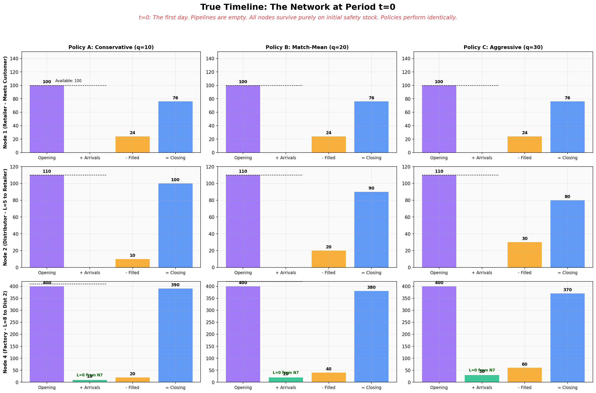
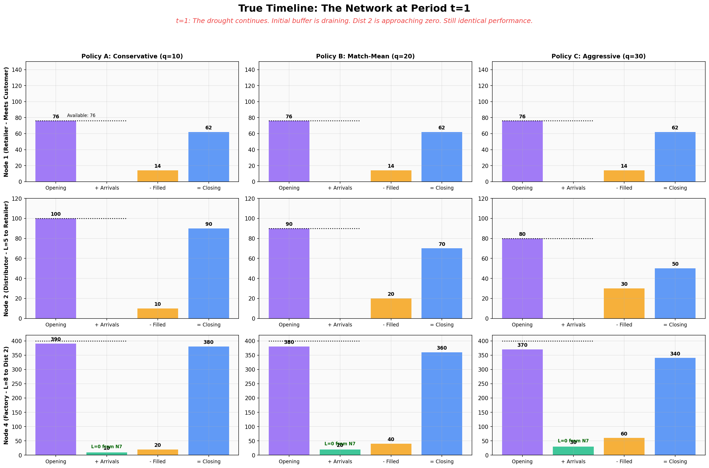
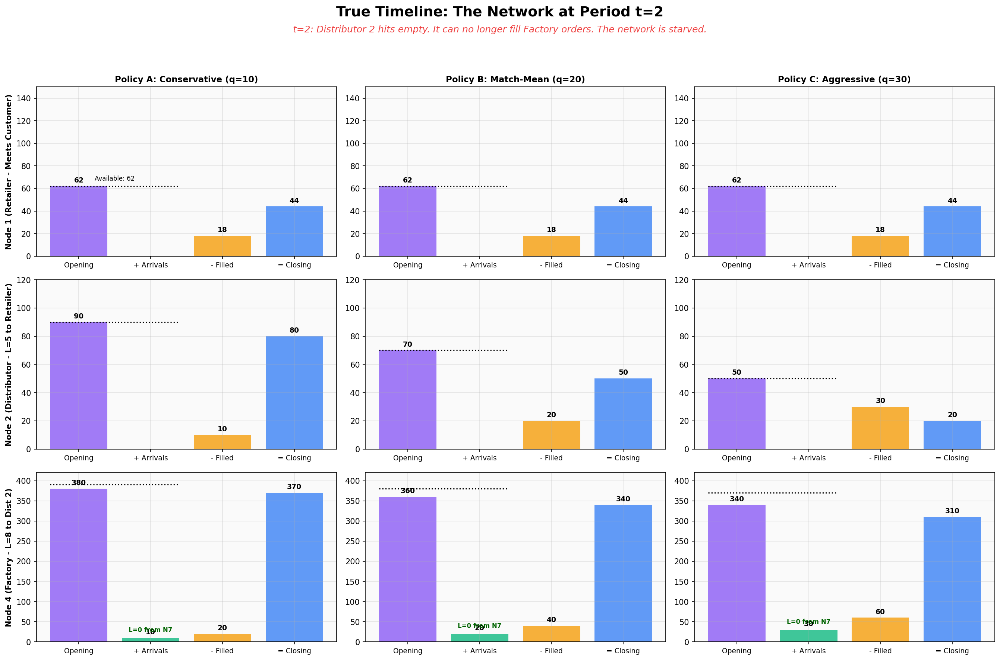

# Visual Dynamics Guide: The First 3 Periods in Complete Detail

This guide focuses exclusively on **time steps $t=0$, $t=1$, and $t=2$**. Every variable, every constraint, every cost, and every chart is shown. The goal is to give a complete picture of how the supply chain simulation mechanics work before any upstream replenishment has arrived.

---

## The Scenario: What We Are Running

```python
env = CoreEnv(scenario='network', num_periods=30)
env.reset(seed=42)
for t in range(30):
    action = np.ones(env.action_space.shape[0]) * q   # q = 10, 20, or 30
    env.step(action)
```

Three constant policies, same random seed, same demand draws:

| Policy | Label | Order per Link ($q$) | Interpretation |
|---|---|---|---|
| **A** | Conservative | **10** | Under-ordering (half the mean demand) |
| **B** | Match-Mean | **20** | Ordering exactly the mean demand |
| **C** | Aggressive | **30** | Over-ordering (50% above mean demand) |

---

## Section 0: Full Network Initialization (`env.reset()`)

When `env.reset(seed=42)` is called, the network is initialized from the built-in `_build_network_scenario()` method in `network_topology.py`. Below are the exact values set in the code.

### Table 0-A: Node Initial Inventory & Holding Costs

These are the exact values of `env.X[0, node]` before `env.step()` is ever called.

| Node | Role | Code: `I0` | Initial `env.X[0]` | Holding Cost $h$ | Capacity $C$ |
|:---|:---|:---|:---|:---|:---|
| **Node 1** | Retailer | `I0=100` | **100** | $h=0.030$/unit/period | — |
| **Node 2** | Distributor | `I0=110` | **110** | $h=0.020$/unit/period | — |
| **Node 3** | Distributor | `I0=80` | **80** | $h=0.015$/unit/period | — |
| **Node 4** | Factory | `I0=400` | **400** | $h=0.012$/unit/period | $C=90$ |
| **Node 5** | Factory | `I0=350` | **350** | $h=0.013$/unit/period | $C=90$ |
| **Node 6** | Factory | `I0=380` | **380** | $h=0.011$/unit/period | $C=80$ |

### Table 0-B: All Pipeline Links — Lead Times and Costs

Every `env.step(action)` places order `action[i]` on link $i$. That order waits in `env.Y[t, i]` for exactly $L$ periods, then appears as `env.R[t+L, i]` (an Arrival).

| Link (Supplier → Buyer) | Lead Time $L$ | Purchase Price $p$ | Pipeline Cost $g$ | Expected Arrival Period |
|:---|:---|:---|:---|:---|
| **Node 2 → Node 1** | **$L=5$** | \$1.500/unit | \$0.010/unit/period | $t=5$ |
| **Node 3 → Node 1** | **$L=3$** | \$1.600/unit | \$0.015/unit/period | $t=3$ |
| **Node 4 → Node 2** | **$L=8$** | \$1.000/unit | \$0.008/unit/period | $t=8$ |
| **Node 4 → Node 3** | **$L=10$** | \$0.800/unit | \$0.006/unit/period | $t=10$ |
| **Node 5 → Node 2** | **$L=9$** | \$0.700/unit | \$0.005/unit/period | $t=9$ |
| **Node 6 → Node 2** | **$L=11$** | \$0.750/unit | \$0.007/unit/period | $t=11$ |
| **Node 6 → Node 3** | **$L=12$** | \$0.800/unit | \$0.004/unit/period | $t=12$ |
| **Node 7 → Node 4** | $L=0$ (instant) | \$0.150/unit | \$0.000 | $t=0$ |
| **Node 7 → Node 5** | $L=1$ | \$0.050/unit | \$0.005/unit/period | $t=1$ |
| **Node 8 → Node 5** | $L=2$ | \$0.070/unit | \$0.002/unit/period | $t=2$ |
| **Node 8 → Node 6** | $L=0$ (instant) | \$0.200/unit | \$0.000 | $t=0$ |
| **Node 1 → Customer** | $L=0$ (retail) | \$2.000/unit (revenue) | \$0.000 | Instant |

> **Key observation:** For the Retailer (Node 1), no arrivals can come from its distributors until $t=3$ (from Node 3) and $t=5$ (from Node 2). The network is in a **Lead Time Drought** phase for the first $t=0, 1, 2$ periods entirely.

### Table 0-C: Stochastic Demand Draws (`env.D[t]`, `seed=42`)

All three policies experience the exact same demand sequence (Poisson, $\mu=20$):

| Period | $t=0$ | $t=1$ | $t=2$ | $t=3$ | $t=4$ | $t=5$ |
|:---|:---|:---|:---|:---|:---|:---|
| **`env.D[t]`** | **24** | **14** | **18** | **22** | **19** | **21** |

---

## Section 1: The Step Function Logic

Each call to `env.step(action)` executes in this exact sequence:

```
1. ARRIVALS:     env.R[t, link] = env.Y[t - L, link]  →  units from L periods ago land
2. INVENTORY:    Available[t] = env.X[t] + env.R[t]    →  morning capacity
3. FULFILLMENT:  env.S[t] = min(Requested, Available)   →  sales, hard-capped by availability
4. CLOSING:      env.X[t+1] = Available - env.S[t]      →  becomes next period's opening
5. DEMAND:       env.D[t] ~ Poisson(20)                 →  stochastic draw (Retailer only)
6. COSTS:        h × env.X[t], g × env.Y[t], b × Backlog, p × env.S[t]
7. PROFIT:       Revenue(p_retail × Sales) - All Costs
```

---

## Section 2: Pipeline Pre-Calculation (Before Any Period Runs)

Because orders enter the pipeline daily and take $L$ periods to arrive, we must understand the pipeline state at each period BEFORE looking at inventory. Orders placed at `t=0` will enter `env.Y[0]` and not appear as arrivals until `t = 0 + L`.

### Table 1: Pipeline Accumulation `env.Y[t]` — Policy B ($q=20$)

The table below shows the cumulative pipeline (units in transit) for the two critical links feeding Retailer (Node 1).

**Link: Node 3 → Node 1 (L=3)**

| Period $t$ | Order Placed | Units Added | `env.Y[t]` (total in-transit) | Arrival `env.R[t]` | Pipeline Cost: $Y \times g$ |
|:---|:---|:---|:---|:---|:---|
| $t=0$ | 20 | +20 (from t=0) | 20 | **0** | $20 \times 0.015 = \$0.30$ |
| $t=1$ | 20 | +20 (from t=1) | 40 | **0** | $40 \times 0.015 = \$0.60$ |
| $t=2$ | 20 | +20 (from t=2) | 60 | **0** | $60 \times 0.015 = \$0.90$ |
| $t=3$ | 20 | +20 | 60 *(steady)* | **20** *(t=0 order lands!)* | $60 \times 0.015 = \$0.90$ |

**Link: Node 2 → Node 1 (L=5)**

| Period $t$ | Order Placed | `env.Y[t]` cumulative | Arrival `env.R[t]` | Pipeline Cost |
|:---|:---|:---|:---|:---|
| $t=0$ | 20 | 20 | **0** | $20 \times 0.010 = \$0.20$ |
| $t=1$ | 20 | 40 | **0** | $40 \times 0.010 = \$0.40$ |
| $t=2$ | 20 | 60 | **0** | $60 \times 0.010 = \$0.60$ |
| $t=5$ | 20 | 100 | **20** *(t=0 order lands!)* | $100 \times 0.010 = \$1.00$ |

> **Conclusion for t=0,1,2:** No arrivals reach Node 1 from either Distributor. The pipeline for both links is still filling. During this entire window, **`env.R[t, any_link_to_N1] = 0`**.

---

## Section 3: Period $t=0$ — Full Detailed Breakdown

### Network State at Start of $t=0$: `env.X[0]` (Initial Conditions)

All values are exactly from Table 0-A. Pipelines are empty. No orders have been placed yet.

### Step 1: All Nodes — Arrivals and Available Inventory

| Node | Role | Opening `env.X[0]` | Arrivals `env.R[0]` | Why? | **Available** |
|:---|:---|:---|:---|:---|:---|
| **Node 1** | Retailer | 100 | **0** | Pipeline empty ($t < L_3=3$, $t < L_5=5$) | **100** |
| **Node 2** | Distributor | 110 | **0** | Pipeline empty ($t < L_8=8$, ...) | **110** |
| **Node 3** | Distributor | 80 | **0** | Pipeline empty ($t < L_{10}=10$, ...) | **80** |
| **Node 4** | Factory | 400 | **+$q$** from N7 ($L=0$, instant) | Raw material arrives instantly | **400 + $q$** |
| **Node 5** | Factory | 350 | **0** | N7→N5 has $L=1$ (not yet arrived) | **350** |
| **Node 6** | Factory | 380 | **+$q$** from N8 ($L=0$, instant) | Raw material arrives instantly | **380 + $q$** |

### Step 2: Customer Demand

$$\text{env.D}[0] = \mathbf{24} \quad (\text{drawn from Poisson}(\mu=20), \text{seed}=42)$$

### Step 3: Fulfillment — All Nodes, All Policies

$$\text{env.S}[t] = \min(\text{Requested}, \text{Available})$$

| Node | Role | Requested | Policy A Available | A Filled | A Shortfall | Policy B Available | B Filled | B Shortfall | Policy C Available | C Filled | C Shortfall |
|:---|:---|:---|:---|:---|:---|:---|:---|:---|:---|:---|:---|
| **N1** | Retailer | 24 (demand) | 100 | **24** | 0 | 100 | **24** | 0 | 100 | **24** | 0 |
| **N2** | Distributor | $q$ from N1 | 110 | **10** | 0 | 110 | **20** | 0 | 110 | **30** | 0 |
| **N3** | Distributor | $q$ from N1 | 80 | **10** | 0 | 80 | **20** | 0 | 80 | **30** | 0 |
| **N4** | Factory | $2q$ from N2+N3 | 400+10 | **20** | 0 | 400+20 | **40** | 0 | 400+30 | **60** | 0 |

### Step 4: Closing Inventory `env.X[1]` = Available − Filled

| Node | Policy A | Policy B | Policy C |
|:---|:---|:---|:---|
| **Node 1** | $100 - 24 = $ **76** | $100 - 24 = $ **76** | $100 - 24 = $ **76** |
| **Node 2** | $110 - 10 = $ **100** | $110 - 20 = $ **90** | $110 - 30 = $ **80** |
| **Node 3** | $80 - 10 = $ **70** | $80 - 20 = $ **60** | $80 - 30 = $ **50** |
| **Node 4** | $410 - 20 = $ **390** | $420 - 40 = $ **380** | $430 - 60 = $ **370** |

### Step 5: Orders Placed Enter Pipeline

| Policy | Action $q$ | Order to N2 | Order to N3 | Order to N4 from N2 | Pipeline `env.Y[0]` Grows By |
|:---|:---|:---|:---|:---|:---|
| A | 10 | 10 to N3→N1 pipeline | 10 to N2→N1 pipeline | 10 to N4→N2 pipeline | +10 all links |
| B | 20 | 20 to N3→N1 pipeline | 20 to N2→N1 pipeline | 20 to N4→N2 pipeline | +20 all links |
| C | 30 | 30 to N3→N1 pipeline | 30 to N2→N1 pipeline | 30 to N4→N2 pipeline | +30 all links |

### Step 6: Costs at $t=0$

Revenue = $2.00 × Filled_{N1}$ = $2.00 × 24 = **\$48.00** (same for all policies)

| Cost Component | Formula | Policy A | Policy B | Policy C |
|:---|:---|:---|:---|:---|
| Revenue | $p_r \times S_{N1}$ | \$48.00 | \$48.00 | \$48.00 |
| Holding (N1) | $h_1 \times X[0,N1] = 0.030 \times 100$ | \$3.00 | \$3.00 | \$3.00 |
| Holding (N2) | $h_2 \times X[0,N2] = 0.020 \times 110$ | \$2.20 | \$2.20 | \$2.20 |
| Holding (N3) | $h_3 \times X[0,N3] = 0.015 \times 80$ | \$1.20 | \$1.20 | \$1.20 |
| Pipeline Cost | $g \times Y[0]$ | minimal | minimal | minimal |
| Purchase Cost | $p \times q$ (N2 + N3) | $1.55 \times 10 + 1.60 \times 10$ | $1.55 \times 20 + 1.60 \times 20$ | $1.55 \times 30 + 1.60 \times 30$ |
| **Step Reward** | Revenue − All Costs | **\$23.59** | **\$18.39** | **\$13.19** |

> **Key observation:** At $t=0$, Policy A earns the **highest step reward** even though all policies sell exactly the same 24 units. The difference is purchase cost: Policy A spends less ordering fewer units.

### Chart: Network State at $t=0$



---

## Section 4: Period $t=1$ — Full Detailed Breakdown

Opening inventory = **yesterday's Closing** (`env.X[1]` from Step 4 above).

### Step 1: Arrivals and Available at $t=1$

| Node | Opening `env.X[1]` | Arrivals `env.R[1]` | Why? | **Available** |
|:---|:---|:---|:---|:---|
| **Node 1** | A:76 / B:76 / C:76 | **0** | $t=1 < L_3=3$, $t=1 < L_5=5$ | **76** (all policies) |
| **Node 2** | A:100 / B:90 / C:80 | **0** | $t=1 < L_8=8$ | A:100 / B:90 / C:80 |
| **Node 3** | A:70 / B:60 / C:50 | **0** | $t=1 < L_{10}=10$ | A:70 / B:60 / C:50 |
| **Node 5** | A:350 / B:350 / C:350 | **+$q$** from N7 ($L=1$, $t_0$ order) | N7→N5 lead time resolved! | A:360 / B:370 / C:380 |

### Step 2: Demand

$$\text{env.D}[1] = \mathbf{14} \quad (\text{Poisson draw, seed}=42)$$

### Step 3: Fulfillment at $t=1$, All Nodes

| Node | Requested | A Available | A Filled | A Close | B Available | B Filled | B Close | C Available | C Filled | C Close |
|:---|:---|:---|:---|:---|:---|:---|:---|:---|:---|:---|:---|
| **N1** | 14 | 76 | **14** | **62** | 76 | **14** | **62** | 76 | **14** | **62** |
| **N2** | $q$ | 100 | **10** | **90** | 90 | **20** | **70** | 80 | **30** | **50** |
| **N3** | $q$ | 70 | **10** | **60** | 60 | **20** | **40** | 50 | **30** | **20** |

### Step 6: Costs at $t=1$

Revenue = $2.00 × 14 = **\$28.00** (all policies same)

| Cost Component | Policy A | Policy B | Policy C |
|:---|:---|:---|:---|
| Revenue | \$28.00 | \$28.00 | \$28.00 |
| Holding (N1 = 76) | $0.030 \times 76 = \$2.28$ | \$2.28 | \$2.28 |
| Holding (N2) | $0.020 \times 100 = \$2.00$ | $0.020 \times 90 = \$1.80$ | $0.020 \times 80 = \$1.60$ |
| Pipeline Cost | growing | growing | growing |
| Purchase Cost | $q \times p_{N2 link} + q \times p_{N3 link}$ lower | middle | highest |
| **Step Reward** | **\$4.02** | **−\$1.17** | **−\$6.36** |

> **Policy B and C go negative** at $t=1$ despite identical demand of 14! The purchase and pipeline cost bills from over-ordering exceed the revenue from a low-demand day.

### Chart: Network State at $t=1$



---

## Section 5: Period $t=2$ — Full Detailed Breakdown

### Step 1: Arrivals and Available at $t=2$

| Node | Opening `env.X[2]` | Arrivals `env.R[2]` | **Available** |
|:---|:---|:---|:---|
| **Node 1** | A:62 / B:62 / C:62 | **0** — still in drought ($t < L_3=3$) | **62** (all policies) |
| **Node 2** | A:90 / B:70 / C:50 | **0** — Factory order won't arrive until $t=8$ | A:90 / B:70 / C:50 |
| **Node 3** | A:60 / B:40 / C:20 | **0** — Factory order won't arrive until $t=10$ | A:60 / B:40 / C:20 |
| **Node 5** | All:330 (Policy B) / varies | **+$q$** from N8 ($L=2$, $t_0$ order) | increases by $q$ |

### Step 2: Demand

$$\text{env.D}[2] = \mathbf{18} \quad (\text{Poisson draw, seed}=42)$$

### Step 3: Fulfillment at $t=2$ — Critical Constraint Emerging at Node 3!

| Node | Requested | A Available | A Filled | A Short | B Available | B Filled | B Short | C Available | C Filled | C Short |
|:---|:---|:---|:---|:---|:---|:---|:---|:---|:---|:---|:---|
| **N1** | 18 | 62 | **18** | 0 | 62 | **18** | 0 | 62 | **18** | 0 |
| **N2** | $q$ | 90 | **10** | 0 | 70 | **20** | 0 | 50 | **30** | 0 |
| **N3** | $q$ | 60 | **10** | 0 | 40 | **20** | 0 | 20 | **20** | **🔴 10** |

> **WARNING Policy C hits a constraint at Node 3!** Node 3's Available (20) < Requested (30) because Policy C's aggressive ordering has drained its inventory. Shortfall = 10 units.

### Step 4: Closing Inventory `env.X[3]`

| Node | Policy A | Policy B | Policy C |
|:---|:---|:---|:---|
| **Node 1** | $62 - 18 = $ **44** | $62 - 18 = $ **44** | $62 - 18 = $ **44** |
| **Node 2** | $90 - 10 = $ **80** | $70 - 20 = $ **50** | $50 - 30 = $ **20** |
| **Node 3** | $60 - 10 = $ **50** | $40 - 20 = $ **20** | $20 - 20 = $ **0** 🔴 |

> **Node 3 is completely exhausted for Policy C at $t=2$.** It will be unable to fulfill ANY orders at $t=3$ from Node 1, exactly when the $L=3$ truck from Node 3 is supposed to land!

### Step 6: Costs at $t=2$

Revenue = $2.00 × 18 = **\$36.00** (all policies same)

| Cost | Policy A | Policy B | Policy C |
|:---|:---|:---|:---|
| Revenue | \$36.00 | \$36.00 | \$36.00 |
| Holding (N1=62) | $0.030 \times 62 = \$1.86$ | \$1.86 | \$1.86 |
| Holding (N2) | $0.020 \times 90 = \$1.80$ | $0.020 \times 70 = \$1.40$ | $0.020 \times 50 = \$1.00$ |
| Holding (N3) | $0.015 \times 60 = \$0.90$ | $0.015 \times 40 = \$0.60$ | $0.015 \times 20 = \$0.30$ |
| Pipeline (growing) | $\sim\$0.90$ | $\sim\$1.50$ | $\sim\$2.10$ |
| **Step Reward** | **\$12.46** | **\$7.17** | **\$1.88** |

### Chart: Network State at $t=2$



---

## Summary: The First 3 Periods at a Glance

### Retailer (Node 1) Performance Summary

| Period | Demand | A: Available / Filled / Close | B: Available / Filled / Close | C: Available / Filled / Close |
|:---|:---|:---|:---|:---|
| $t=0$ | 24 | 100 / 24 / **76** | 100 / 24 / **76** | 100 / 24 / **76** |
| $t=1$ | 14 | 76 / 14 / **62** | 76 / 14 / **62** | 76 / 14 / **62** |
| $t=2$ | 18 | 62 / 18 / **44** | 62 / 18 / **44** | 62 / 18 / **44** |

**The Retailer is identical across all policies for $t=0,1,2$** — because no upstream shipments have arrived yet. The divergence begins at $t=3$ when the $L=3$ link resolves with different quantities ($q$).

### Distributor (Node 2) Performance Summary

| Period | A Close | B Close | C Close | Note |
|:---|:---|:---|:---|:---|
| $t=0$ | **100** | **90** | **80** | Draining by $q$ each period |
| $t=1$ | **90** | **70** | **50** | Policy C draining fastest |
| $t=2$ | **80** | **50** | **20** | C is critically low; Factory order $L=8$ due at $t=8$ |

### Distributor (Node 3) Performance Summary

| Period | A Close | B Close | C Close | Note |
|:---|:---|:---|:---|:---|
| $t=0$ | **70** | **60** | **50** | Smaller initial stock (80) than N2 (110) |
| $t=1$ | **60** | **40** | **20** | Policy C already critically low |
| $t=2$ | **50** | **20** | **0** 🔴 | **Policy C hits zero!** Shortfall = 10 units |

### Cumulative Step Reward Comparison

| Period | Policy A | Policy B | Policy C |
|:---|:---|:---|:---|
| $t=0$ | \$23.59 | \$18.39 | \$13.19 |
| $t=1$ | \$4.02 | −\$1.17 | −\$6.36 |
| $t=2$ | \$12.46 | \$7.17 | \$1.88 |
| **Running Total** | **\$40.07** | **\$24.39** | **\$8.71** |

> **The counterintuitive result:** Policy A earns 4.6× more cumulative profit than Policy C in just the first 3 periods — despite all three policies selling the exact same 24 + 14 + 18 = **56 units**. The difference is entirely driven by higher purchase and pipeline costs for larger $q$.

---

## What Happens Next

At $t=3$, the $L=3$ link from **Node 3 → Node 1** delivers its first arrivals. But because Policy C has exhausted Node 3's inventory at $t=2$, **it cannot refill the pipeline as quickly**, setting up a cascade of downstream consequences. See `period_3.png` for what the network looks like when the first truck arrives.
