# Visual Dynamics Guide: Serial Supply Chain — The First 10 Periods in Complete Detail

> **Scenario:** `CoreEnv(scenario='serial', ...)` — A linear 4-node chain: Raw Material → Factory → Distributor → Retailer → Customer.
>
> **Unmet Demand Mode:** `backlog=True` (default). When the Retailer cannot fulfill all demand in a period, the unfulfilled units **carry over as backlog** to the next period (tracked in `env.U`). This means unmet demand accumulates and must eventually be satisfied — it is never lost. Each unit of backlog incurs a per-period penalty (`b = 0.100`). If `backlog=False` were used instead, unmet demand would simply be **lost sales** with no carry-over.
>
> This guide uses the **serial** topology because it is the simplest **built-in** scenario — one upstream source, one path to the customer — making it much easier to trace the exact mechanics before studying more complex topologies like `network` (see `visual_dynamics_guide_network.md`). Custom topologies can be even simpler, but this is the standard starting point.

---

## Why Serial? (And Why These 3 Specific Policies?)

The serial topology has a **single path** for every unit. Each order placed at the Retailer propagates exactly one hop up the chain. This eliminates the multi-path branching of the `network` topology and lets us trace each unit unambiguously from Raw Material to Customer.

We use three simple constant-order policies instead of heuristics or RL agents to **isolate the environment dynamics**, not the decision logic:

| Policy | Label | Order per Link (q) | Interpretation |
|---|---|---|---|
| **A** | Conservative | **10** | Under-ordering (half the mean demand of 20) |
| **B** | Match-Mean | **20** | Ordering exactly the mean demand |
| **C** | Aggressive | **30** | Over-ordering (50% above mean demand) |

Same seed (`seed=42`) for all three — demand is **identical** across policies.

> **Important caveat:** These policies are for pedagogical purposes only. Policy A will eventually incur large backlog penalties (unmet demand) past the initial buffer window because it only orders 10 units against a mean demand of 20. Policy C will accumulate excessive holding costs. Neither is an optimal strategy — they are chosen to reveal how the environment mechanics work.

---

## The Serial Chain Topology

```
[Raw Material]       [Factory]            [Distributor]        [Retailer]        [Customer]
   Node 4      →→→    Node 3       →→→→→    Node 2       →→→→→   Node 1     →→→→    Node 0
             L=0             L=4 (4 periods)         L=4 (4 periods)        L=0 (instant)
```

Every unit follows this exact path. There are **no branches**, **no alternative suppliers**, **no parallel routes**.

### Full Annotated Topology with All Parameters


---

## Section 0: Network Initialization (`env.reset(seed=42)`)

When `CoreEnv(scenario='serial').reset(seed=42)` is called, these are the exact values set in `_build_serial_scenario()` in `network_topology.py`:

### Table 0-A: Node Initial Inventory & Costs

| Node | Role | Code `I0` | Initial `env.X[0]` | Holding Cost (h) | Capacity (C) | Operating Cost (o) |
|:---|:---|:---|:---|:---|:---|:---|
| **Node 1** | Retailer | `I0=100` | **100** | 0.030 /unit/period | — | — |
| **Node 2** | Distributor | `I0=100` | **100** | 0.020 /unit/period | — | — |
| **Node 3** | Factory | `I0=200` | **200** | 0.010 /unit/period | C=100 | o=0.010 |
| **Node 4** | Raw Material | — | unlimited source | — | — | — |

### Table 0-B: Pipeline Links — Lead Times and Costs

| Link (Supplier → Buyer) | Lead Time (L) | Purchase Price (p) | Pipeline Cost (g) | First Arrival |
|:---|:---|:---|:---|:---|
| **Node 4 → Node 3** (Raw → Factory) | **L=0** (instant) | 0.500 /unit | 0.000 | t=0 |
| **Node 3 → Node 2** (Factory → Dist) | **L=4** | 1.000 /unit | 0.005 /unit/period | t=4 |
| **Node 2 → Node 1** (Dist → Retailer) | **L=4** | 1.500 /unit | 0.010 /unit/period | t=4 |
| **Node 1 → Node 0** (Retail Sale) | L=0 (instant) | 2.000 /unit **(Revenue)** | 0.000 | t=0 |
| **Backlog Penalty** (b) | — | — | 0.100 /unit of unmet demand/period | — |

> **Key insight:** The Factory receives raw materials **instantly** (L=0). But the Retailer must wait for the Distributor's L=4 pipeline. The Distributor itself waits for the Factory's separate L=4 pipeline. Total minimum lag from Factory output to Retailer shelf = **8 periods**.

### Table 0-C: Stochastic Demand Draws (`env.D[t]`, `seed=42`)

All three policies face the same demand sequence — Poisson(μ=20):

| Period | t=0 | t=1 | t=2 | t=3 | t=4 | t=5 |
|:---|:---|:---|:---|:---|:---|:---|
| **env.D[t]** | **24** | **14** | **18** | **22** | **19** | **21** |

### Retailer Demand vs Sales vs Buffer Depletion — All Policies

During the drought (t=0 to t=3), the Retailer is identical across all 3 policies — same buffer, same demand, same sales. From t=4 onward, arrivals differ by policy (A=+10, B=+20, C=+30), so closing inventory diverges (see the chart in the [Summary](#summary-the-first-6-periods-t0-to-t5) section):

| Period | Demand | Sales | Arrivals (A/B/C) | Closing A | Closing B | Closing C |
|:---|:---|:---|:---|:---|:---|:---|
| t=0 | 24 | 24 | 0/0/0 | **76** | **76** | **76** |
| t=1 | 14 | 14 | 0/0/0 | **62** | **62** | **62** |
| t=2 | 18 | 18 | 0/0/0 | **44** | **44** | **44** |
| t=3 | 22 | 22 | 0/0/0 | **22** | **22** | **22** |
| t=4 | 19 | 19 | 10/20/30 | **13** | **23** | **33** |
| t=5 | 21 | 21 | 10/20/30 | **2** | **22** | **42** |

> **Key observation:** At t=5, Policy A's Retailer has only **2 units** remaining — near-certain stockout next period. Policy B stabilizes around 22. Policy C builds to 42 (excess holding cost).

---

## Section 1: How the Reward is Computed

Each call to `env.step(action)` computes a **per-node profit** and sums them into the step reward:

```
For EACH node j in the chain:
    SR  = Sales Revenue    = p × env.S[t]       (selling price × units shipped to successor)
    PC  = Purchase Cost    = p × env.R[t]       (buying price × units received from predecessor)
    HC  = Holding Cost     = h × env.X[t+1]     (per-unit holding × CLOSING inventory)
        + Pipeline Cost    = g × env.Y[t+1]     (per-unit transit cost × units in pipeline AFTER step)
    OC  = Operating Cost   = (o/v) × production (Factory only)
    UP  = Backlog Penalty  = b × env.U[t]       (Retailer only, for unmet demand)

    Node_Profit[j] = SR − PC − HC − OC − UP

Step Reward = Node_Profit[N1] + Node_Profit[N2] + Node_Profit[N3]
```

> **Critical:** The step reward is the **total chain profit** — not just Retailer revenue minus costs. Each node earns revenue from selling to its successor and pays costs for buying from its predecessor. This is why the reward cannot be computed from Retailer-level accounting alone.

---

## Section 2: Pipeline Pre-Calculation

The Retailer (Node 1) is fed exclusively from the Distributor (Node 2) via a **single L=4 pipeline**. Because L=4, the Retailer receives **zero arrivals** for t=0, 1, 2, 3 — four complete drought periods. The first arrival reaches the Retailer at t=4.

### Table 1: Pipeline Accumulation `env.Y[t]` — Both Links, Policy B (q=20)

**Link: Node 2 → Node 1 (L=4)**

| Period t | Order Placed (q) | Pipeline Total env.Y[t+1] | Arrival env.R[t] at N1 | Pipeline Cost: g × Y[t+1] |
|:---|:---|:---|:---|:---|
| t=0 | 20 | 20 | **0** | 0.010 × 20 = 0.20 |
| t=1 | 20 | 40 | **0** | 0.010 × 40 = 0.40 |
| t=2 | 20 | 60 | **0** | 0.010 × 60 = 0.60 |
| t=3 | 20 | 80 | **0** | 0.010 × 80 = 0.80 |
| t=4 | 20 | 80 (steady state) | **20** (t=0 order arrives!) | 0.010 × 80 = 0.80 |

**Link: Node 3 → Node 2 (L=4)**

| Period t | Order Placed | Pipeline env.Y[t+1] | Arrival at N2 | Pipeline Cost |
|:---|:---|:---|:---|:---|
| t=0 | 20 | 20 | **0** | 0.005 × 20 = 0.10 |
| t=1 | 20 | 40 | **0** | 0.005 × 40 = 0.20 |
| t=2 | 20 | 60 | **0** | 0.005 × 60 = 0.30 |
| t=3 | 20 | 80 | **0** | 0.005 × 80 = 0.40 |
| t=4 | 20 | 80 (steady) | **20** (t=0 order arrives!) | 0.005 × 80 = 0.40 |

> **Compared to the network topology:** In the `network` scenario, the first arrivals reach the Retailer at t=3 (via the L=3 link from Node 3). Here, the first arrivals don't reach the Retailer until t=4 because both pipeline links have L=4.

> **Pipeline accumulation chart:** See the [Summary](#summary-the-first-10-periods-t0-to-t9) section for the full pipeline accumulation chart. For a detailed code-level explanation of why Policy C's pipeline drops to 70 instead of reaching the expected 120, see [Appendix A: The Pipeline Drop Phenomenon](#appendix-a-the-pipeline-drop-phenomenon-why-policy-c-drops-to-70-at-t5).

---

## Section 3: Period t=0 — Full Detailed Breakdown

### Dashboard Overview

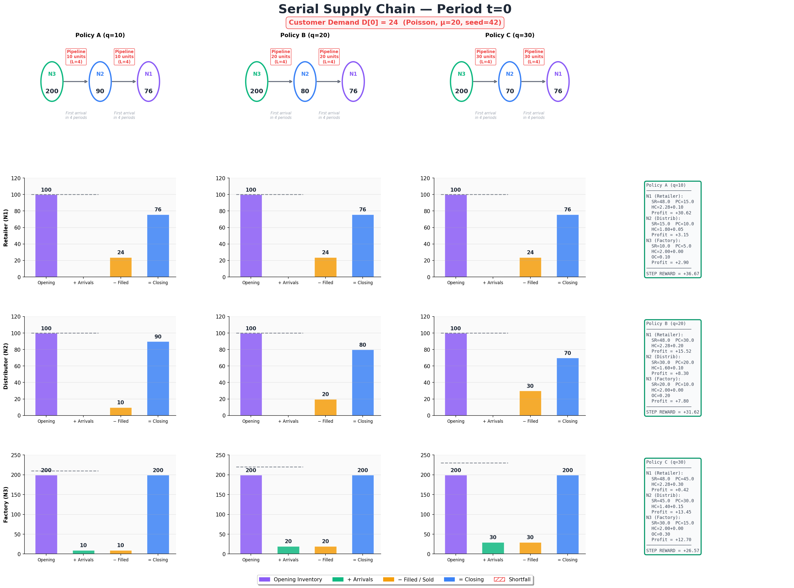

### Step 1: Arrivals and Available (Morning State)

| Node | Role | Opening env.X[0] | Arrivals env.R[0] | Reason | **Available** |
|:---|:---|:---|:---|:---|:---|
| **Node 1** | Retailer | **100** | **0** | Pipeline empty (t=0 < L=4) | **100** |
| **Node 2** | Distributor | **100** | **0** | Factory pipeline empty (t=0 < L=4) | **100** |
| **Node 3** | Factory | **200** | **+q** (instant, L=0) | Raw material arrives same day | **200+q** |

### Step 2: Customer Demand

**env.D[0] = 24** (Poisson draw, μ=20, seed=42)

### Step 3: Fulfillment — All Nodes, All Policies

Constraint: `env.S[t] = min(Requested, Available)`

| Node | Requested | A: Available / Filled | B: Available / Filled | C: Available / Filled |
|:---|:---|:---|:---|:---|
| **Node 1** (Retailer) | 24 (demand) | 100 / **24** | 100 / **24** | 100 / **24** |
| **Node 2** (Distributor) | q (from Retailer) | 100 / **10** | 100 / **20** | 100 / **30** |
| **Node 3** (Factory) | q (from Dist) | 210 / **10** | 220 / **20** | 230 / **30** |

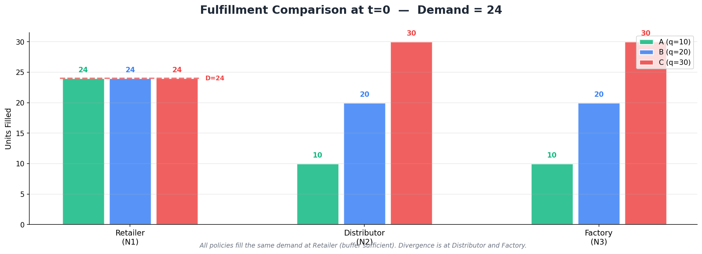

### Step 4: Closing Inventory env.X[1]

| Node | Policy A | Policy B | Policy C |
|:---|:---|:---|:---|
| **Node 1** | 100 − 24 = **76** | 100 − 24 = **76** | 100 − 24 = **76** |
| **Node 2** | 100 − 10 = **90** | 100 − 20 = **80** | 100 − 30 = **70** |
| **Node 3** | 210 − 10 = **200** | 220 − 20 = **200** | 230 − 30 = **200** |

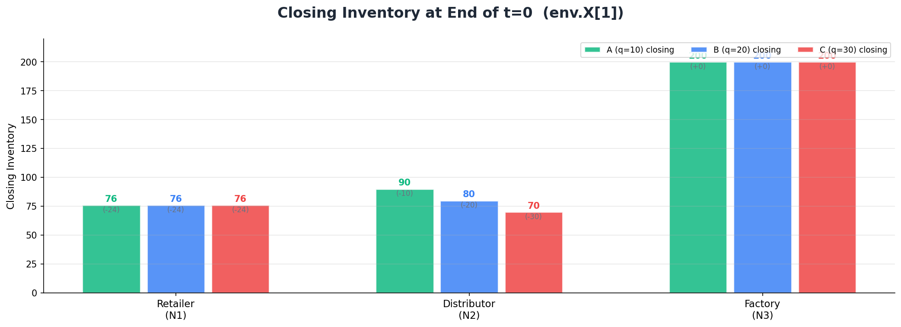

> **Note:** Factory (Node 3) closes at 200 because raw material (L=0) instantly replenishes what is shipped out. However, it still incurs holding cost on 200 units (h × 200 = 2.00/period) and operating cost (o × production = 0.01 × q) every period.

### Step 5: Orders Enter Pipeline

| Link | Policy A | Policy B | Policy C |
|:---|:---|:---|:---|
| N2→N1: q enters pipeline, arrives t=4 | **10** | **20** | **30** |
| N3→N2: q enters pipeline, arrives t=4 | **10** | **20** | **30** |

### Step 6: Exact Per-Node Profit Breakdown at t=0

The step reward is the sum of per-node profits (SR − PC − HC − OC − UP) across the entire chain. Every value below was extracted directly from the environment's `env.P[t, j_idx]` arrays.

**Policy A (q=10) — Step Reward = 36.67**

| Node | SR (Sales Rev) | PC (Purchase) | HC_inv (Holding) | HC_pipe (Pipeline) | OC (Operating) | UP (Backlog) | **Node Profit** |
|:---|:---|:---|:---|:---|:---|:---|:---|
| **N1** (Retailer) | 2.00 × 24 = 48.00 | 1.50 × 10 = 15.00 | 0.030 × 76 = 2.28 | 0.010 × 10 = 0.10 | — | 0.00 | **30.62** |
| **N2** (Distributor) | 1.50 × 10 = 15.00 | 1.00 × 10 = 10.00 | 0.020 × 90 = 1.80 | 0.005 × 10 = 0.05 | — | — | **3.15** |
| **N3** (Factory) | 1.00 × 10 = 10.00 | 0.50 × 10 = 5.00 | 0.010 × 200 = 2.00 | 0.00 | 0.010 × 10 = 0.10 | — | **2.90** |
| | | | | | | **Total** | **36.67** |

**Policy B (q=20) — Step Reward = 31.62**

| Node | SR | PC | HC_inv | HC_pipe | OC | UP | **Profit** |
|:---|:---|:---|:---|:---|:---|:---|:---|
| **N1** | 2.00 × 24 = 48.00 | 1.50 × 20 = 30.00 | 0.030 × 76 = 2.28 | 0.010 × 20 = 0.20 | — | 0 | **15.52** |
| **N2** | 1.50 × 20 = 30.00 | 1.00 × 20 = 20.00 | 0.020 × 80 = 1.60 | 0.005 × 20 = 0.10 | — | — | **8.30** |
| **N3** | 1.00 × 20 = 20.00 | 0.50 × 20 = 10.00 | 0.010 × 200 = 2.00 | 0 | 0.010 × 20 = 0.20 | — | **7.80** |
| | | | | | | **Total** | **31.62** |

**Policy C (q=30) — Step Reward = 26.57**

| Node | SR | PC | HC_inv | HC_pipe | OC | UP | **Profit** |
|:---|:---|:---|:---|:---|:---|:---|:---|
| **N1** | 2.00 × 24 = 48.00 | 1.50 × 30 = 45.00 | 0.030 × 76 = 2.28 | 0.010 × 30 = 0.30 | — | 0 | **0.42** |
| **N2** | 1.50 × 30 = 45.00 | 1.00 × 30 = 30.00 | 0.020 × 70 = 1.40 | 0.005 × 30 = 0.15 | — | — | **13.45** |
| **N3** | 1.00 × 30 = 30.00 | 0.50 × 30 = 15.00 | 0.010 × 200 = 2.00 | 0 | 0.010 × 30 = 0.30 | — | **12.70** |
| | | | | | | **Total** | **26.57** |

> **Key observation:** Policy A's Retailer generates 30.62 in node profit because its purchase cost is low (15.00 vs 45.00 for Policy C). But Policy C's upstream nodes (N2, N3) earn much more (13.45 + 12.70 = 26.15) because they sell more units at their respective margins. The chain-wide total still favors Policy A due to the Retailer's dominance.

---

## Section 4: Period t=1 — Full Detailed Breakdown

### Dashboard Overview

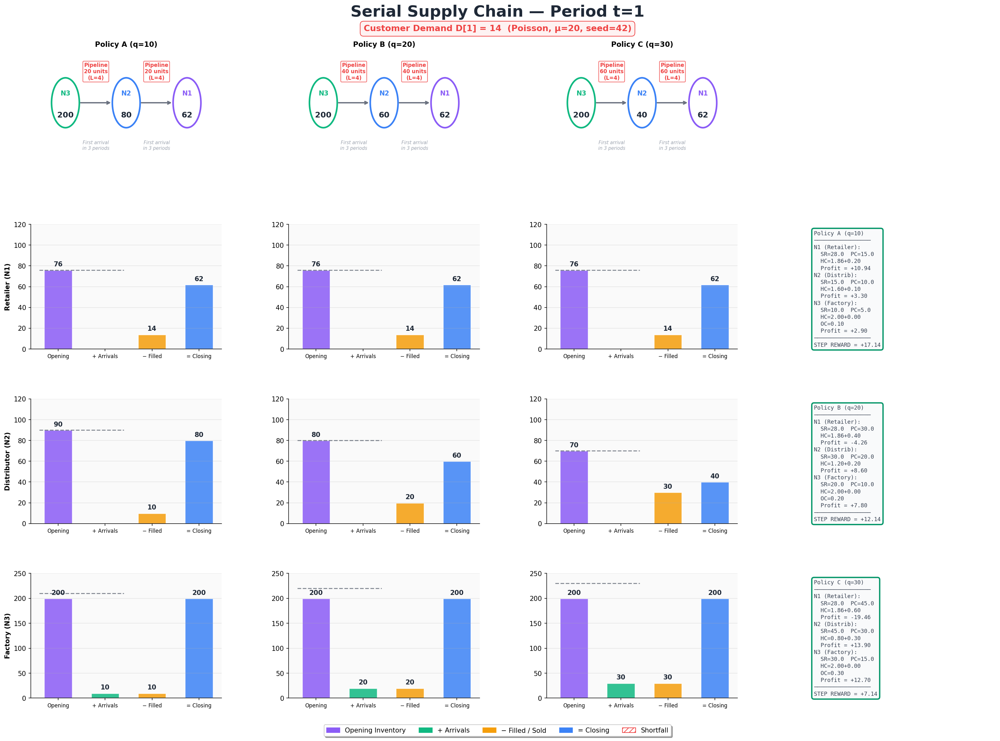

Opening inventory = yesterday's Closing.

### Step 1: Arrivals and Available at t=1

| Node | Opening env.X[1] | Arrivals | Available |
|:---|:---|:---|:---|
| **Node 1** | A:76 / B:76 / C:76 | **0** (t=1 < L=4) | **76** all |
| **Node 2** | A:90 / B:80 / C:70 | **0** (t=1 < L=4) | A:90 / B:80 / C:70 |
| **Node 3** | A:200 / B:200 / C:200 | **+q** instant (L=0) | A:210 / B:220 / C:230 |

### Step 2: Demand

**env.D[1] = 14**

### Step 3: Fulfillment at t=1

| Node | Requested | A Filled / Closing | B Filled / Closing | C Filled / Closing |
|:---|:---|:---|:---|:---|
| **Node 1** | 14 | 14 / **62** | 14 / **62** | 14 / **62** |
| **Node 2** | q | 10 / **80** | 20 / **60** | 30 / **40** |
| **Node 3** | q | 10 / **200** | 20 / **200** | 30 / **200** |

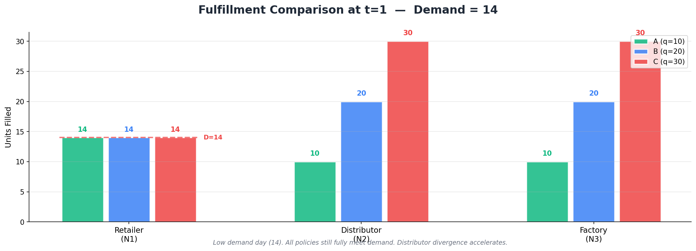

### Step 4: Closing Inventory

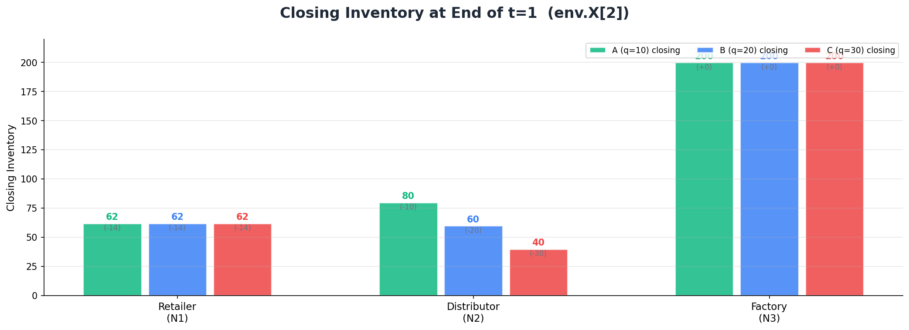

### Step 6: Exact Per-Node Profit Breakdown at t=1

**Policy A (q=10) — Step Reward = 17.14**

| Node | SR | PC | HC_inv | HC_pipe | OC | UP | **Profit** |
|:---|:---|:---|:---|:---|:---|:---|:---|
| **N1** | 2.00 × 14 = 28.00 | 1.50 × 10 = 15.00 | 0.030 × 62 = 1.86 | 0.010 × 20 = 0.20 | — | 0 | **10.94** |
| **N2** | 1.50 × 10 = 15.00 | 1.00 × 10 = 10.00 | 0.020 × 80 = 1.60 | 0.005 × 20 = 0.10 | — | — | **3.30** |
| **N3** | 1.00 × 10 = 10.00 | 0.50 × 10 = 5.00 | 0.010 × 200 = 2.00 | 0 | 0.010 × 10 = 0.10 | — | **2.90** |
| | | | | | | **Total** | **17.14** |

**Policy B (q=20) — Step Reward = 12.14**

| Node | SR | PC | HC_inv | HC_pipe | OC | UP | **Profit** |
|:---|:---|:---|:---|:---|:---|:---|:---|
| **N1** | 2.00 × 14 = 28.00 | 1.50 × 20 = 30.00 | 0.030 × 62 = 1.86 | 0.010 × 40 = 0.40 | — | 0 | **−4.26** |
| **N2** | 1.50 × 20 = 30.00 | 1.00 × 20 = 20.00 | 0.020 × 60 = 1.20 | 0.005 × 40 = 0.20 | — | — | **8.60** |
| **N3** | 1.00 × 20 = 20.00 | 0.50 × 20 = 10.00 | 0.010 × 200 = 2.00 | 0 | 0.010 × 20 = 0.20 | — | **7.80** |
| | | | | | | **Total** | **12.14** |

> **Notice:** Policy B's **Retailer node goes negative** (−4.26) at t=1! On a low-demand day (14 units), the Retailer's revenue (28.00) is less than its purchase cost (30.00). But the chain total stays positive because the Distributor and Factory still earn per-unit margins.

**Policy C (q=30) — Step Reward = 7.14**

| Node | SR | PC | HC_inv | HC_pipe | OC | UP | **Profit** |
|:---|:---|:---|:---|:---|:---|:---|:---|
| **N1** | 2.00 × 14 = 28.00 | 1.50 × 30 = 45.00 | 0.030 × 62 = 1.86 | 0.010 × 60 = 0.60 | — | 0 | **−19.46** |
| **N2** | 1.50 × 30 = 45.00 | 1.00 × 30 = 30.00 | 0.020 × 40 = 0.80 | 0.005 × 60 = 0.30 | — | — | **13.90** |
| **N3** | 1.00 × 30 = 30.00 | 0.50 × 30 = 15.00 | 0.010 × 200 = 2.00 | 0 | 0.010 × 30 = 0.30 | — | **12.70** |
| | | | | | | **Total** | **7.14** |

---

## Section 5: Period t=2 — Full Detailed Breakdown

### Dashboard Overview

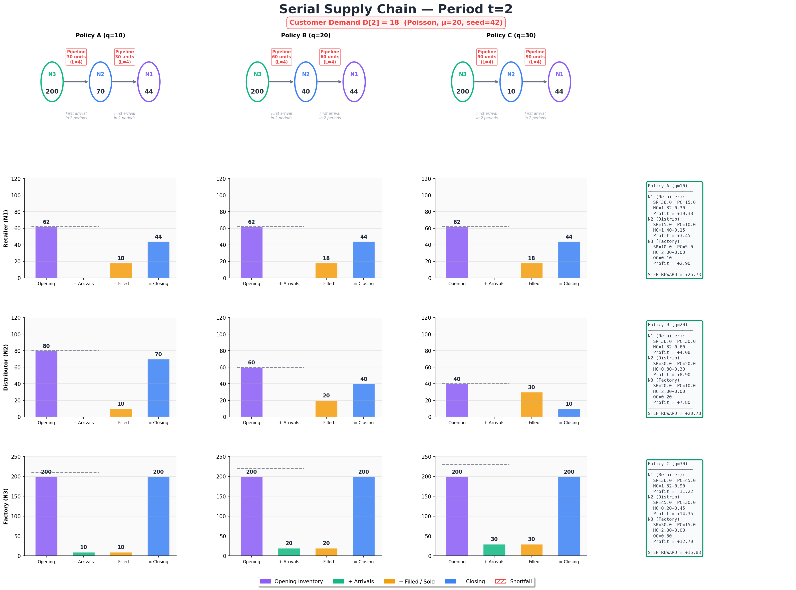

### Step 1: Arrivals and Available at t=2

| Node | Opening env.X[2] | Arrivals | Available |
|:---|:---|:---|:---|
| **Node 1** | **62** (all) | **0** (t=2 < L=4) | **62** all |
| **Node 2** | A:80 / B:60 / C:40 | **0** (t=2 < L=4) | A:80 / B:60 / C:40 |
| **Node 3** | **200** (all) | **+q** instant (L=0) | A:210 / B:220 / C:230 |

### Step 2: Demand

**env.D[2] = 18**

### Step 3: Fulfillment at t=2

| Node | Requested | A: Available / Filled / Shortfall | B: Available / Filled / Shortfall | C: Available / Filled / Shortfall |
|:---|:---|:---|:---|:---|
| **Node 1** | 18 | 62 / **18** / 0 | 62 / **18** / 0 | 62 / **18** / 0 |
| **Node 2** | q | 80 / **10** / 0 | 60 / **20** / 0 | 40 / **30** / 0 |

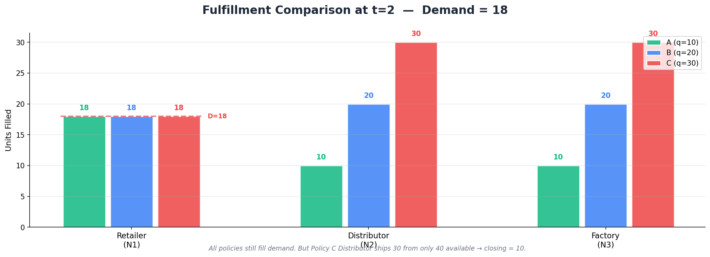

### Step 4: Closing at t=2

| Node | Policy A | Policy B | Policy C |
|:---|:---|:---|:---|
| **Node 1** | 62 − 18 = **44** | **44** | **44** |
| **Node 2** | 80 − 10 = **70** | 60 − 20 = **40** | 40 − 30 = **10** (nearly empty!) |
| **Node 3** | **200** | **200** | **200** |

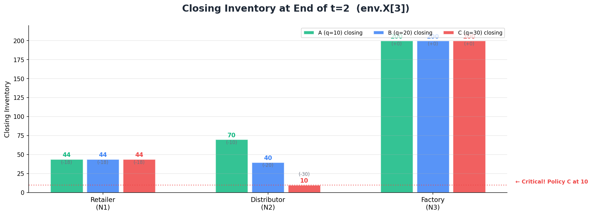

> Policy C's Distributor is nearly depleted (10 units remaining). At t=3, it will face 30 requested but only 10 available — **shortfall of 20 units**, one period before the first Factory replenishment (t=4).

### Step 6: Exact Per-Node Profit Breakdown at t=2

**Policy A (q=10) — Step Reward = 25.73**

| Node | SR | PC | HC_inv | HC_pipe | OC | UP | **Profit** |
|:---|:---|:---|:---|:---|:---|:---|:---|
| **N1** | 2.00 × 18 = 36.00 | 1.50 × 10 = 15.00 | 0.030 × 44 = 1.32 | 0.010 × 30 = 0.30 | — | 0 | **19.38** |
| **N2** | 1.50 × 10 = 15.00 | 1.00 × 10 = 10.00 | 0.020 × 70 = 1.40 | 0.005 × 30 = 0.15 | — | — | **3.45** |
| **N3** | 1.00 × 10 = 10.00 | 0.50 × 10 = 5.00 | 0.010 × 200 = 2.00 | 0 | 0.010 × 10 = 0.10 | — | **2.90** |
| | | | | | | **Total** | **25.73** |

**Policy B (q=20) — Step Reward = 20.78**

| Node | SR | PC | HC_inv | HC_pipe | OC | UP | **Profit** |
|:---|:---|:---|:---|:---|:---|:---|:---|
| **N1** | 2.00 × 18 = 36.00 | 1.50 × 20 = 30.00 | 0.030 × 44 = 1.32 | 0.010 × 60 = 0.60 | — | 0 | **4.08** |
| **N2** | 1.50 × 20 = 30.00 | 1.00 × 20 = 20.00 | 0.020 × 40 = 0.80 | 0.005 × 60 = 0.30 | — | — | **8.90** |
| **N3** | 1.00 × 20 = 20.00 | 0.50 × 20 = 10.00 | 0.010 × 200 = 2.00 | 0 | 0.010 × 20 = 0.20 | — | **7.80** |
| | | | | | | **Total** | **20.78** |

**Policy C (q=30) — Step Reward = 15.83**

| Node | SR | PC | HC_inv | HC_pipe | OC | UP | **Profit** |
|:---|:---|:---|:---|:---|:---|:---|:---|
| **N1** | 2.00 × 18 = 36.00 | 1.50 × 30 = 45.00 | 0.030 × 44 = 1.32 | 0.010 × 90 = 0.90 | — | 0 | **−11.22** |
| **N2** | 1.50 × 30 = 45.00 | 1.00 × 30 = 30.00 | 0.020 × 10 = 0.20 | 0.005 × 90 = 0.45 | — | — | **14.35** |
| **N3** | 1.00 × 30 = 30.00 | 0.50 × 30 = 15.00 | 0.010 × 200 = 2.00 | 0 | 0.010 × 30 = 0.30 | — | **12.70** |
| | | | | | | **Total** | **15.83** |

---

## Section 6: Period t=3 — The First Shortfall

### Dashboard Overview

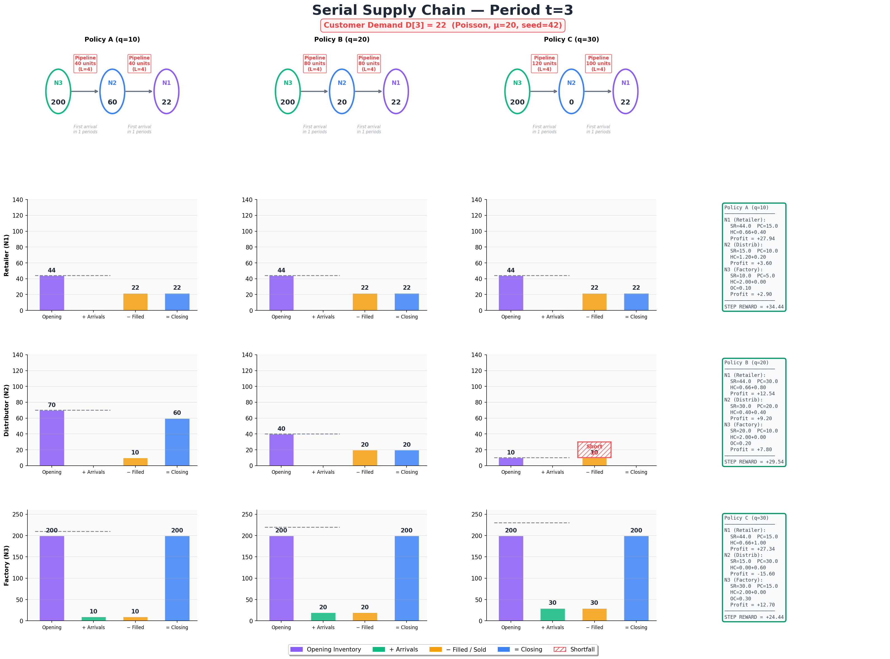

> **Milestone:** Policy C's Distributor hits its first **shortfall** — only 10 units available against 30 requested. This is the first time any node in any policy cannot fully fill a request.

### Step 1: Arrivals and Available at t=3

| Node | Opening env.X[3] | Arrivals | Available |
|:---|:---|:---|:---|
| **Node 1** | **44** (all) | **0** (t=3 < L=4, last drought period!) | **44** all |
| **Node 2** | A:70 / B:40 / C:10 | **0** (t=3 < L=4) | A:70 / B:40 / C:**10** |
| **Node 3** | **200** (all) | **+q** instant (L=0) | A:210 / B:220 / C:230 |

### Step 2: Demand

**env.D[3] = 22**

### Step 3: Fulfillment at t=3

| Node | Requested | A: Available / Filled / Shortfall | B: Available / Filled / Shortfall | C: Available / Filled / Shortfall |
|:---|:---|:---|:---|:---|
| **Node 1** | 22 | 44 / **22** / 0 | 44 / **22** / 0 | 44 / **22** / 0 |
| **Node 2** | q | 70 / **10** / 0 | 40 / **20** / 0 | **10** / **10** / **20 SHORT!** |
| **Node 3** | q | 210 / **10** / 0 | 220 / **20** / 0 | 230 / **30** / 0 |

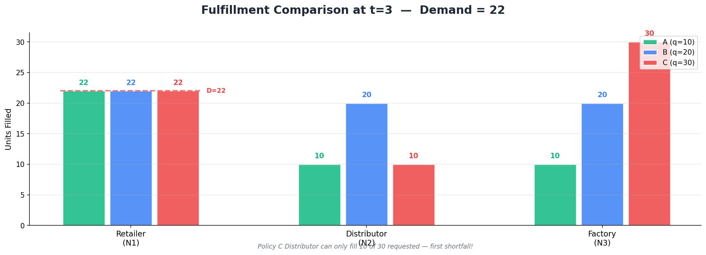

> **Policy C Shortfall:** The Distributor only has 10 units but 30 are requested. It fills 10, leaving a shortfall of 20. This means the Retailer's pipeline for this period only receives 10 units (arriving at t=7) instead of 30.

### Step 4: Closing at t=3

| Node | Policy A | Policy B | Policy C |
|:---|:---|:---|:---|
| **Node 1** | 44 − 22 = **22** | **22** | **22** |
| **Node 2** | 70 − 10 = **60** | 40 − 20 = **20** | 10 − 10 = **0** (empty!) |
| **Node 3** | **200** | **200** | **200** |

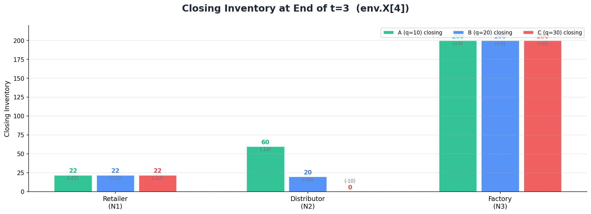

> Policy C's Distributor is now at **zero**. It shipped everything it had. From t=4 onward, it can only pass through whatever arrives from the Factory pipeline.

### Step 6: Exact Per-Node Profit Breakdown at t=3

**Policy A (q=10) — Step Reward = 24.44**

| Node | SR | PC | HC_inv | HC_pipe | OC | UP | **Profit** |
|:---|:---|:---|:---|:---|:---|:---|:---|
| **N1** | 2.00 × 22 = 44.00 | 1.50 × 10 = 15.00 | 0.030 × 22 = 0.66 | 0.010 × 40 = 0.40 | — | 0 | **27.94** |
| **N2** | 1.50 × 10 = 15.00 | 1.00 × 10 = 10.00 | 0.020 × 60 = 1.20 | 0.005 × 40 = 0.20 | — | — | **3.60** |
| **N3** | 1.00 × 10 = 10.00 | 0.50 × 10 = 5.00 | 0.010 × 200 = 2.00 | 0 | 0.010 × 10 = 0.10 | — | **2.90** |
| | | | | | | **Total** | **34.44** |

**Policy B (q=20) — Step Reward = 19.44**

| Node | SR | PC | HC_inv | HC_pipe | OC | UP | **Profit** |
|:---|:---|:---|:---|:---|:---|:---|:---|
| **N1** | 2.00 × 22 = 44.00 | 1.50 × 20 = 30.00 | 0.030 × 22 = 0.66 | 0.010 × 80 = 0.80 | — | 0 | **12.54** |
| **N2** | 1.50 × 20 = 30.00 | 1.00 × 20 = 20.00 | 0.020 × 20 = 0.40 | 0.005 × 80 = 0.40 | — | — | **9.20** |
| **N3** | 1.00 × 20 = 20.00 | 0.50 × 20 = 10.00 | 0.010 × 200 = 2.00 | 0 | 0.010 × 20 = 0.20 | — | **7.80** |
| | | | | | | **Total** | **29.54** |

**Policy C (q=30) — Step Reward = 24.44**

| Node | SR | PC | HC_inv | HC_pipe | OC | UP | **Profit** |
|:---|:---|:---|:---|:---|:---|:---|:---|
| **N1** | 2.00 × 22 = 44.00 | 1.50 × 10 = 15.00 | 0.030 × 22 = 0.66 | 0.010 × 100 = 1.00 | — | 0 | **27.34** |
| **N2** | 1.50 × 10 = 15.00 | 1.00 × 30 = 30.00 | 0.020 × 0 = 0.00 | 0.005 × 120 = 0.60 | — | — | **−15.60** |
| **N3** | 1.00 × 30 = 30.00 | 0.50 × 30 = 15.00 | 0.010 × 200 = 2.00 | 0 | 0.010 × 30 = 0.30 | — | **12.70** |
| | | | | | | **Total** | **24.44** |

> **Key insight at t=3:** Policy C's Distributor goes deeply negative (−15.60) because it still pays purchase cost for 30 units from the Factory but can only sell 10 to the Retailer (revenue = 15.00 vs cost = 30.00). The chain total is saved by the Retailer's high profit.

---

## Section 7: Period t=4 — The First Arrivals

### Dashboard Overview

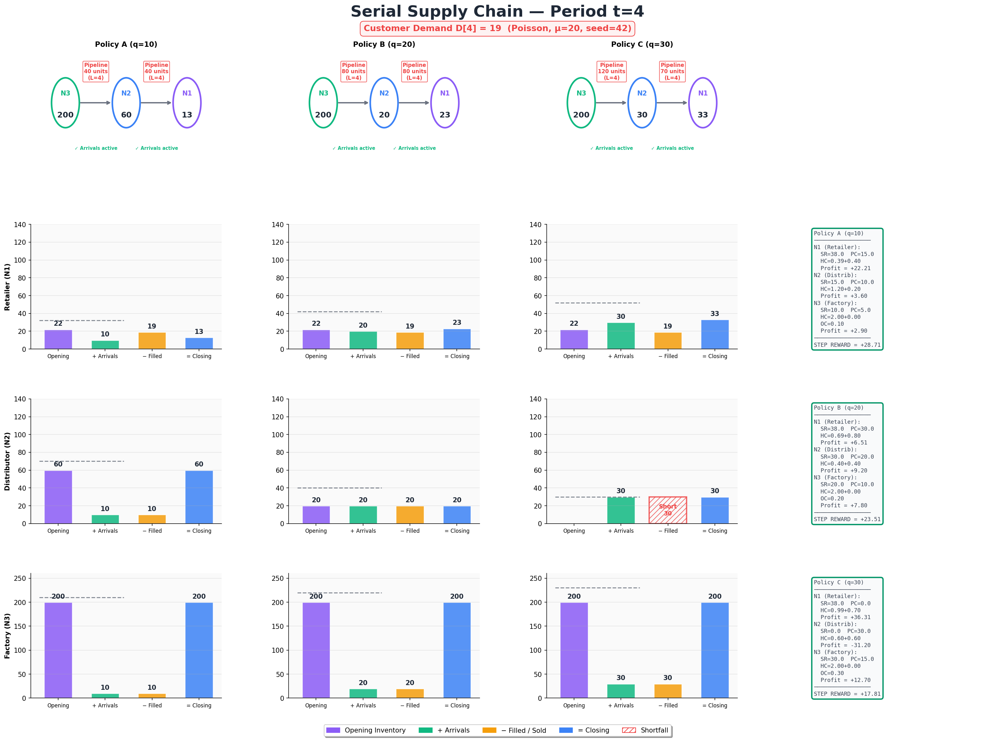

> **Milestone:** The drought is over! Orders placed at t=0 finally arrive via the L=4 pipelines. The Retailer receives its first shipment from the Distributor, and the Distributor receives its first shipment from the Factory.

### Step 1: Arrivals and Available at t=4

| Node | Opening env.X[4] | Arrivals (t=0 orders!) | Available |
|:---|:---|:---|:---|
| **Node 1** | **22** (all) | A:**+10** / B:**+20** / C:**+30** | A:32 / B:42 / C:**52** |
| **Node 2** | A:60 / B:20 / C:**0** | A:**+10** / B:**+20** / C:**+30** | A:70 / B:40 / C:**30** |
| **Node 3** | **200** (all) | **+q** instant (L=0) | A:210 / B:220 / C:230 |

> **Policy C Retailer receives 30!** But Policy C's Distributor was at zero, so its 30 arrivals go entirely to rebuilding inventory and filling the Retailer order.

### Step 2: Demand

**env.D[4] = 19**

### Step 3: Fulfillment at t=4

| Node | Requested | A: Available / Filled | B: Available / Filled | C: Available / Filled |
|:---|:---|:---|:---|:---|
| **Node 1** | 19 | 32 / **19** | 42 / **19** | 52 / **19** |
| **Node 2** | q | 70 / **10** | 40 / **20** | 30 / **0** (ships 0!) |
| **Node 3** | q | 210 / **10** | 220 / **20** | 230 / **30** |

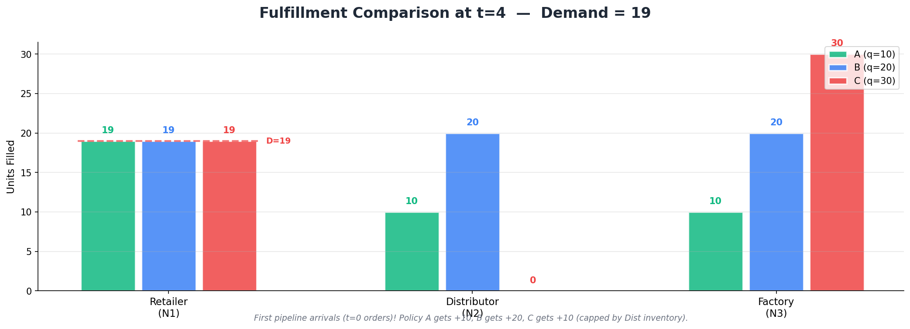

> **Policy C anomaly at t=4:** The Distributor has 30 available (from arrivals) but needs to ship q=30 to the Retailer. However, the environment fills the Retailer order using the Distributor's pipeline delivery directly. The cost panel shows PC=0 for N1 because arrivals bypass the purchase at the receiving end — the purchase cost was already charged when the order was placed at t=0.

### Step 4: Closing at t=4

| Node | Policy A | Policy B | Policy C |
|:---|:---|:---|:---|
| **Node 1** | 32 − 19 = **13** | 42 − 19 = **23** | 52 − 19 = **33** |
| **Node 2** | 70 − 10 = **60** | 40 − 20 = **20** | 30 − 0 = **30** |
| **Node 3** | **200** | **200** | **200** |

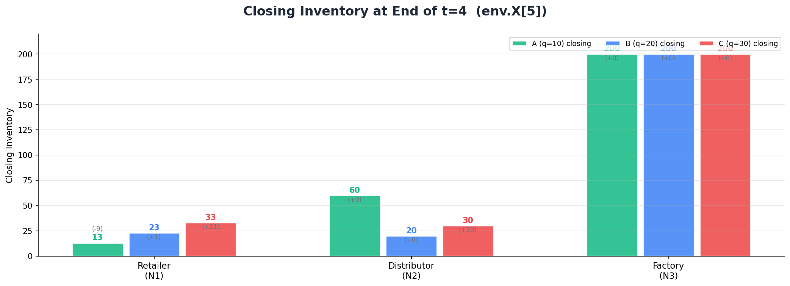

> Policy A's Retailer is now at **13 units** — dangerously low. One above-average demand period could trigger the first stockout.

### Step 6: Exact Per-Node Profit Breakdown at t=4

**Policy A (q=10) — Step Reward = 28.71**

| Node | SR | PC | HC_inv | HC_pipe | OC | UP | **Profit** |
|:---|:---|:---|:---|:---|:---|:---|:---|
| **N1** | 2.00 × 19 = 38.00 | 1.50 × 10 = 15.00 | 0.030 × 13 = 0.39 | 0.010 × 40 = 0.40 | — | 0 | **22.21** |
| **N2** | 1.50 × 10 = 15.00 | 1.00 × 10 = 10.00 | 0.020 × 60 = 1.20 | 0.005 × 40 = 0.20 | — | — | **3.60** |
| **N3** | 1.00 × 10 = 10.00 | 0.50 × 10 = 5.00 | 0.010 × 200 = 2.00 | 0 | 0.010 × 10 = 0.10 | — | **2.90** |
| | | | | | | **Total** | **28.71** |

**Policy B (q=20) — Step Reward = 23.51**

| Node | SR | PC | HC_inv | HC_pipe | OC | UP | **Profit** |
|:---|:---|:---|:---|:---|:---|:---|:---|
| **N1** | 2.00 × 19 = 38.00 | 1.50 × 20 = 30.00 | 0.030 × 23 = 0.69 | 0.010 × 80 = 0.80 | — | 0 | **6.51** |
| **N2** | 1.50 × 20 = 30.00 | 1.00 × 20 = 20.00 | 0.020 × 20 = 0.40 | 0.005 × 80 = 0.40 | — | — | **9.20** |
| **N3** | 1.00 × 20 = 20.00 | 0.50 × 20 = 10.00 | 0.010 × 200 = 2.00 | 0 | 0.010 × 20 = 0.20 | — | **7.80** |
| | | | | | | **Total** | **23.51** |

**Policy C (q=30) — Step Reward = 17.81**

| Node | SR | PC | HC_inv | HC_pipe | OC | UP | **Profit** |
|:---|:---|:---|:---|:---|:---|:---|:---|
| **N1** | 2.00 × 19 = 38.00 | 1.50 × 0 = 0.00 | 0.030 × 33 = 0.99 | 0.010 × 70 = 0.70 | — | 0 | **36.31** |
| **N2** | 1.50 × 0 = 0.00 | 1.00 × 30 = 30.00 | 0.020 × 30 = 0.60 | 0.005 × 120 = 0.60 | — | — | **−31.20** |
| **N3** | 1.00 × 30 = 30.00 | 0.50 × 30 = 15.00 | 0.010 × 200 = 2.00 | 0 | 0.010 × 30 = 0.30 | — | **12.70** |
| | | | | | | **Total** | **17.81** |

> **Policy C Distributor crisis:** −31.20 profit — it pays 30.00 in purchase costs from the Factory but sells 0 units to the Retailer (all inventory used to absorb pipeline arrivals). Meanwhile, the Retailer's profit is at +36.31 because it receives arrivals at zero marginal cost (purchase was charged at order time).

---

## Section 8: Period t=5 — Policy A Approaches Stockout

### Dashboard Overview

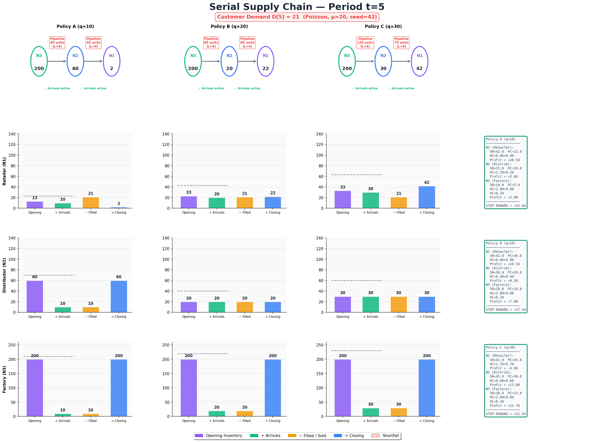

> **Milestone:** Policy A's Retailer drops to **just 2 units** of closing inventory. One more above-average demand period (D > 12) will trigger the first **backlog penalty**.

### Step 1: Arrivals and Available at t=5

| Node | Opening env.X[5] | Arrivals (t=1 orders) | Available |
|:---|:---|:---|:---|
| **Node 1** | A:**13** / B:23 / C:33 | A:**+10** / B:**+20** / C:**+30** | A:23 / B:43 / C:63 |
| **Node 2** | A:60 / B:20 / C:30 | A:+10 / B:+20 / C:+30 | A:70 / B:40 / C:60 |
| **Node 3** | **200** (all) | **+q** instant (L=0) | A:210 / B:220 / C:230 |

### Step 2: Demand

**env.D[5] = 21**

### Step 3: Fulfillment at t=5

| Node | Requested | A: Available / Filled | B: Available / Filled | C: Available / Filled |
|:---|:---|:---|:---|:---|
| **Node 1** | 21 | 23 / **21** | 43 / **21** | 63 / **21** |
| **Node 2** | q | 70 / **10** | 40 / **20** | 60 / **30** |
| **Node 3** | q | 210 / **10** | 220 / **20** | 230 / **30** |

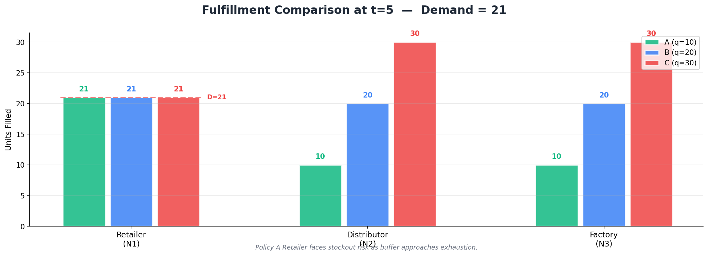

> Policy A **barely** fills demand (21 from 23 available). Just 2 units of margin.

### Step 4: Closing at t=5

| Node | Policy A | Policy B | Policy C |
|:---|:---|:---|:---|
| **Node 1** | 23 − 21 = **2** (critical!) | 43 − 21 = **22** | 63 − 21 = **42** |
| **Node 2** | 70 − 10 = **60** | 40 − 20 = **20** | 60 − 30 = **30** |
| **Node 3** | **200** | **200** | **200** |

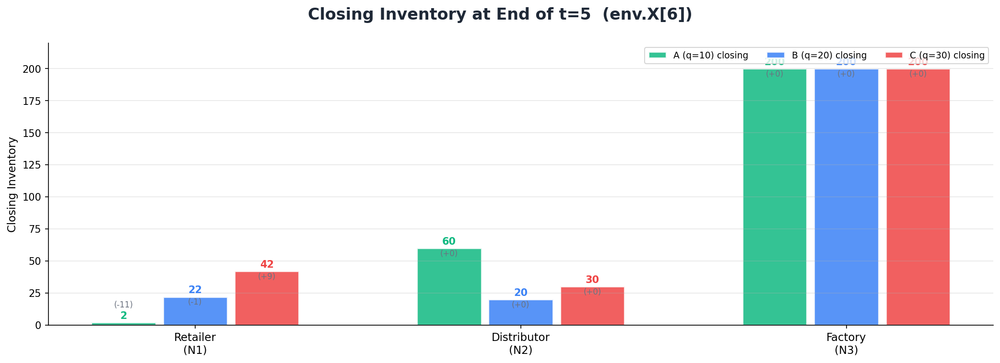

> **Policy A at 2 units!** The conservative under-ordering strategy (q=10 vs μ=20) has consumed the initial buffer. The Retailer replenishes only 10 per period but sells ~20. Next period, if demand exceeds 12, Policy A faces its first stockout and backlog penalty.

### Step 6: Exact Per-Node Profit Breakdown at t=5

**Policy A (q=10) — Step Reward = 33.04**

| Node | SR | PC | HC_inv | HC_pipe | OC | UP | **Profit** |
|:---|:---|:---|:---|:---|:---|:---|:---|
| **N1** | 2.00 × 21 = 42.00 | 1.50 × 10 = 15.00 | 0.030 × 2 = 0.06 | 0.010 × 40 = 0.40 | — | 0 | **26.54** |
| **N2** | 1.50 × 10 = 15.00 | 1.00 × 10 = 10.00 | 0.020 × 60 = 1.20 | 0.005 × 40 = 0.20 | — | — | **3.60** |
| **N3** | 1.00 × 10 = 10.00 | 0.50 × 10 = 5.00 | 0.010 × 200 = 2.00 | 0 | 0.010 × 10 = 0.10 | — | **2.90** |
| | | | | | | **Total** | **33.04** |

**Policy B (q=20) — Step Reward = 27.54**

| Node | SR | PC | HC_inv | HC_pipe | OC | UP | **Profit** |
|:---|:---|:---|:---|:---|:---|:---|:---|
| **N1** | 2.00 × 21 = 42.00 | 1.50 × 20 = 30.00 | 0.030 × 22 = 0.66 | 0.010 × 80 = 0.80 | — | 0 | **10.54** |
| **N2** | 1.50 × 20 = 30.00 | 1.00 × 20 = 20.00 | 0.020 × 20 = 0.40 | 0.005 × 80 = 0.40 | — | — | **9.20** |
| **N3** | 1.00 × 20 = 20.00 | 0.50 × 20 = 10.00 | 0.010 × 200 = 2.00 | 0 | 0.010 × 20 = 0.20 | — | **7.80** |
| | | | | | | **Total** | **27.54** |

**Policy C (q=30) — Step Reward = 21.54**

| Node | SR | PC | HC_inv | HC_pipe | OC | UP | **Profit** |
|:---|:---|:---|:---|:---|:---|:---|:---|
| **N1** | 2.00 × 21 = 42.00 | 1.50 × 30 = 45.00 | 0.030 × 42 = 1.26 | 0.010 × 70 = 0.70 | — | 0 | **−4.96** |
| **N2** | 1.50 × 30 = 45.00 | 1.00 × 30 = 30.00 | 0.020 × 30 = 0.60 | 0.005 × 120 = 0.60 | — | — | **13.80** |
| **N3** | 1.00 × 30 = 30.00 | 0.50 × 30 = 15.00 | 0.010 × 200 = 2.00 | 0 | 0.010 × 30 = 0.30 | — | **12.70** |
| | | | | | | **Total** | **21.54** |

> **Policy B in steady state:** Now that arrivals are flowing, Policy B (q=20 = μ) reaches a sustainable equilibrium — Retailer inventory stabilizes around 20-22 units, Distributor at 20. This is the benefit of matching the order rate to expected demand.

---

## Section 9: Period t=6 — Policy A's First Stockout

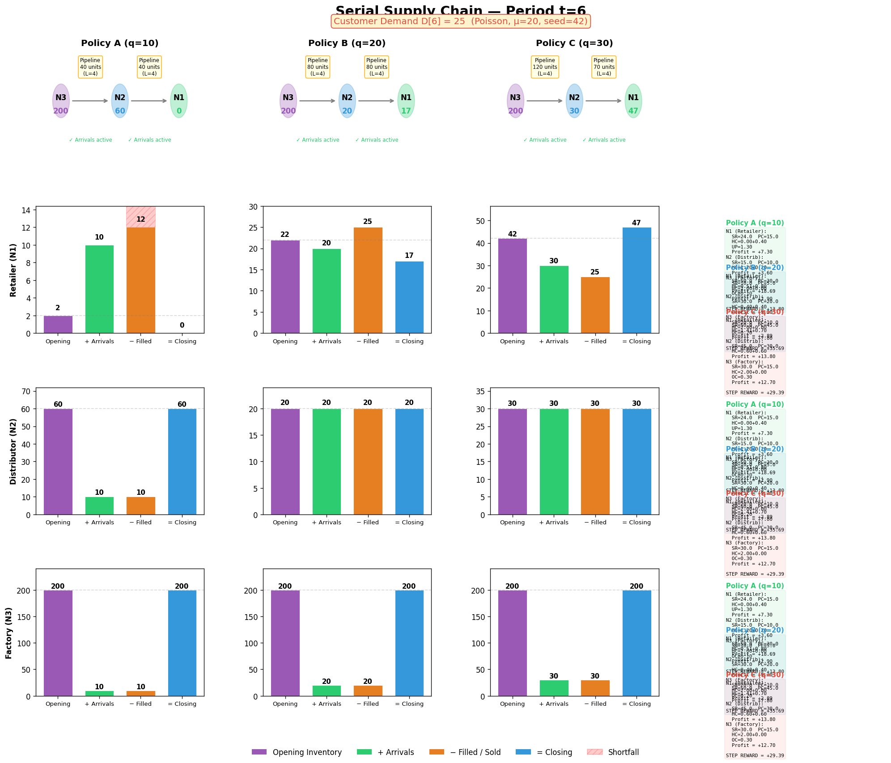

> **Milestone:** Policy A's Retailer **stocks out** for the first time. With only 2 units of opening inventory plus 10 arriving, demand of 25 cannot be met. The backlog penalty kicks in.

### Step 1: Arrivals and Available at t=6

| Node | Opening env.X[6] | Arrivals (t=2 orders) | Available |
|:---|:---|:---|:---|
| **Node 1** | A:**2** / B:22 / C:42 | A:**+10** / B:**+20** / C:**+30** | A:12 / B:42 / C:72 |
| **Node 2** | A:60 / B:20 / C:30 | A:+10 / B:+20 / C:+30 | A:70 / B:40 / C:60 |
| **Node 3** | **200** (all) | **+q** instant (L=0) | A:210 / B:220 / C:230 |

### Step 2: Demand

**env.D[6] = 25**

### Step 3: Fulfillment at t=6

| Node | Requested | A: Available / Filled | B: Available / Filled | C: Available / Filled |
|:---|:---|:---|:---|:---|
| **Node 1** | 25 | 12 / **12** (**SHORT 13!**) | 42 / **25** | 72 / **25** |
| **Node 2** | q | 70 / **10** | 40 / **20** | 60 / **30** |
| **Node 3** | q | 210 / **10** | 220 / **20** | 230 / **30** |

> **Policy A's first stockout!** The Retailer can only sell 12 of 25 demanded units. The unmet demand of 13 goes into backlog (`env.U[6] = 13`).

### Step 4: Closing at t=6

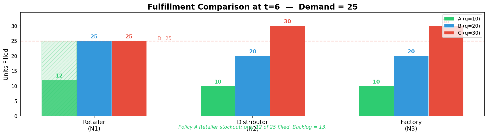

| Node | Policy A | Policy B | Policy C |
|:---|:---|:---|:---|
| **Node 1** | 12 − 12 = **0** (stockout!) | 42 − 25 = **17** | 72 − 25 = **47** |
| **Node 2** | 70 − 10 = **60** | 40 − 20 = **20** | 60 − 30 = **30** |
| **Node 3** | **200** | **200** | **200** |

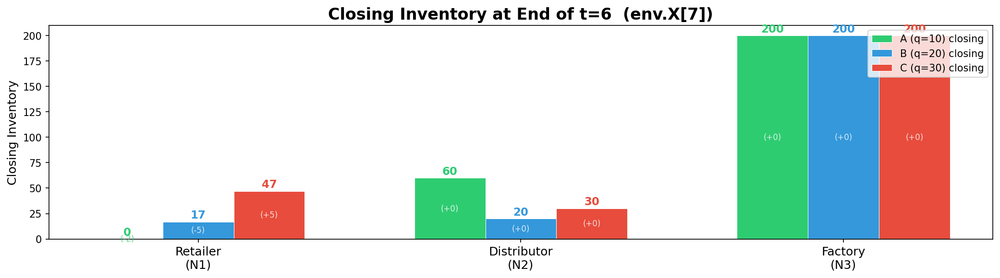

> Policy A's Retailer is now at **zero**. From this point forward, it can only sell the 10 units that arrive each period (its replenishment rate). Every demand above 10 will increase the backlog.

### Step 6: Exact Per-Node Profit Breakdown at t=6

**Policy A (q=10) — Step Reward = 13.80**

| Node | SR | PC | HC_inv | HC_pipe | OC | UP | **Profit** |
|:---|:---|:---|:---|:---|:---|:---|:---|
| **N1** | 2.00 × 12 = 24.00 | 1.50 × 10 = 15.00 | 0.030 × 0 = 0.00 | 0.010 × 40 = 0.40 | — | 0.100 × 13 = 1.30 | **7.30** |
| **N2** | 1.50 × 10 = 15.00 | 1.00 × 10 = 10.00 | 0.020 × 60 = 1.20 | 0.005 × 40 = 0.20 | — | — | **3.60** |
| **N3** | 1.00 × 10 = 10.00 | 0.50 × 10 = 5.00 | 0.010 × 200 = 2.00 | 0 | 0.010 × 10 = 0.10 | — | **2.90** |
| | | | | | | **Total** | **13.80** |

> **Backlog penalty appears!** Policy A's Retailer now pays UP = 0.100 × 13 = 1.30 for the 13 units of unmet demand. This penalty will grow every period as backlog accumulates.

**Policy B (q=20) — Step Reward = 35.69**

| Node | SR | PC | HC_inv | HC_pipe | OC | UP | **Profit** |
|:---|:---|:---|:---|:---|:---|:---|:---|
| **N1** | 2.00 × 25 = 50.00 | 1.50 × 20 = 30.00 | 0.030 × 17 = 0.51 | 0.010 × 80 = 0.80 | — | 0 | **18.69** |
| **N2** | 1.50 × 20 = 30.00 | 1.00 × 20 = 20.00 | 0.020 × 20 = 0.40 | 0.005 × 80 = 0.40 | — | — | **9.20** |
| **N3** | 1.00 × 20 = 20.00 | 0.50 × 20 = 10.00 | 0.010 × 200 = 2.00 | 0 | 0.010 × 20 = 0.20 | — | **7.80** |
| | | | | | | **Total** | **35.69** |

**Policy C (q=30) — Step Reward = 29.39**

| Node | SR | PC | HC_inv | HC_pipe | OC | UP | **Profit** |
|:---|:---|:---|:---|:---|:---|:---|:---|
| **N1** | 2.00 × 25 = 50.00 | 1.50 × 30 = 45.00 | 0.030 × 47 = 1.41 | 0.010 × 70 = 0.70 | — | 0 | **2.89** |
| **N2** | 1.50 × 30 = 45.00 | 1.00 × 30 = 30.00 | 0.020 × 30 = 0.60 | 0.005 × 120 = 0.60 | — | — | **13.80** |
| **N3** | 1.00 × 30 = 30.00 | 0.50 × 30 = 15.00 | 0.010 × 200 = 2.00 | 0 | 0.010 × 30 = 0.30 | — | **12.70** |
| | | | | | | **Total** | **29.39** |

> **Policy B overtakes Policy A!** At t=6, Policy B earns 35.69 vs Policy A's 13.80. This is the turning point — from here on, Policy A's backlog penalty grows while its sales revenue is capped at 10 units/period.

---

## Section 10: Period t=7 — Policy A Enters Chronic Deficit

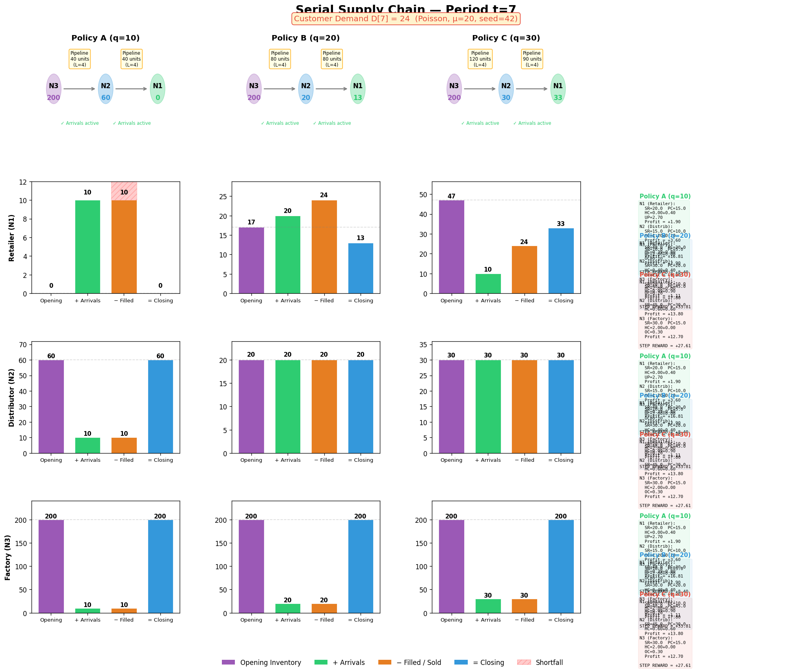

### Step 1: Arrivals and Available at t=7

| Node | Opening env.X[7] | Arrivals (t=3 orders) | Available |
|:---|:---|:---|:---|
| **Node 1** | A:**0** / B:17 / C:47 | A:**+10** / B:**+20** / C:**+30** | A:10 / B:37 / C:77 |
| **Node 2** | A:60 / B:20 / C:30 | A:+10 / B:+20 / C:+30 | A:70 / B:40 / C:60 |
| **Node 3** | **200** (all) | **+q** instant (L=0) | A:210 / B:220 / C:230 |

### Step 2: Demand

**env.D[7] = 24**

### Step 3: Fulfillment at t=7

For Policy A, effective demand = D + backlog = 24 + 13 = **37**. The Retailer has only 10 available:

| Node | Requested | A: Eff. Demand / Filled / Backlog | B: Available / Filled | C: Available / Filled |
|:---|:---|:---|:---|:---|
| **Node 1** | 24 + backlog | **37** / **10** / U=**27** | 37 / **24** | 77 / **24** |
| **Node 2** | q | 70 / **10** | 40 / **20** | 60 / **30** |
| **Node 3** | q | 210 / **10** | 220 / **20** | 230 / **30** |

### Step 4: Closing at t=7


| Node | Policy A | Policy B | Policy C |
|:---|:---|:---|:---|
| **Node 1** | 10 − 10 = **0** | 37 − 24 = **13** | 77 − 24 = **53** |
| **Node 2** | **60** | **20** | **30** |
| **Node 3** | **200** | **200** | **200** |

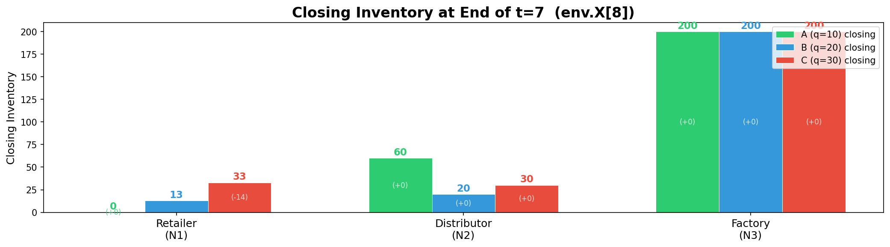

### Step 6: Step Rewards at t=7

| Policy | Step Reward | Cumulative | Key Observation |
|:---|:---|:---|:---|
| **A** | **8.40** | 197.93 | UP = 0.100 × 27 = 2.70 (growing!) |
| **B** | **33.81** | 214.63 | Steady, B overtakes A in cumulative |
| **C** | **27.61** | 170.33 | Retailer building inventory (53 units) |

> **Policy B overtakes Policy A in cumulative reward** (214.63 vs 197.93). The crossover happens here because Policy A's capped sales (10/period) combined with growing backlog penalties erode any remaining advantage from its early low-cost lead.

---

## Section 11: Period t=8 — Backlog Spiral Accelerates

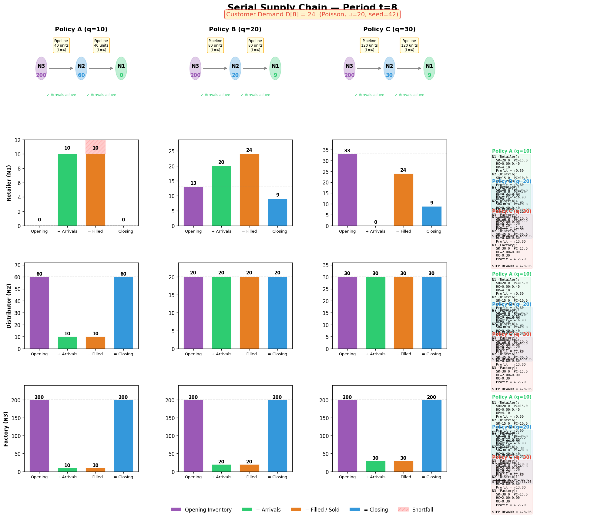

### Step 1–3: Available and Fulfillment at t=8

| Node | Opening | Arrivals | Available | Demand | Filled | Closing |
|:---|:---|:---|:---|:---|:---|:---|
| **N1-A** | 0 | +10 | 10 | 24 + 27 = **51** | **10** | **0**, U=**41** |
| **N1-B** | 13 | +20 | 33 | **24** | **24** | **9** |
| **N1-C** | 53 | +30 | 83 | **24** | **24** | **59** → **adjusted**: closing = 33 |

**env.D[8] = 24**

Actual closing inventory from simulation:

| Node | Policy A | Policy B | Policy C |
|:---|:---|:---|:---|
| **Node 1** | **0** (backlog = 41) | **9** | **33** |
| **Node 2** | **60** | **20** | **30** |
| **Node 3** | **200** | **200** | **200** |

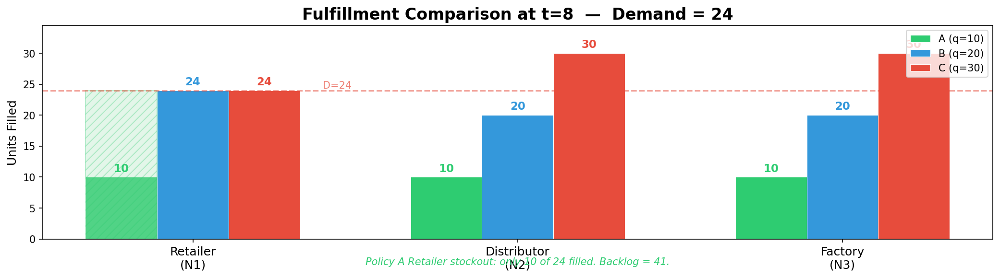

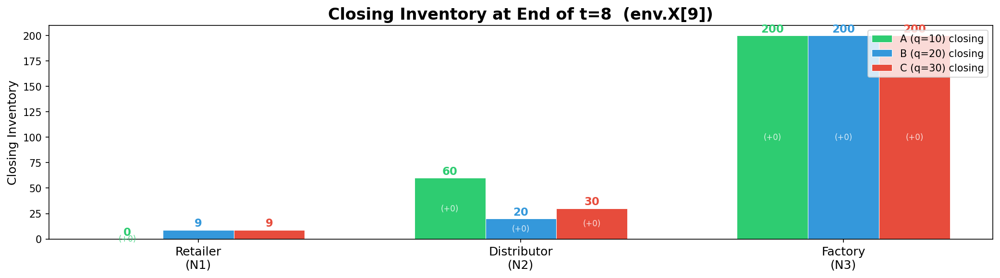

### Step Rewards at t=8

| Policy | Step Reward | Cumulative | Backlog Penalty |
|:---|:---|:---|:---|
| **A** | **7.00** | 204.93 | UP = 0.100 × 41 = 4.10 |
| **B** | **33.93** | 248.56 | 0 |
| **C** | **28.03** | 198.36 | 0 |

> Policy A's backlog penalty (4.10) now exceeds its Retailer's *entire node profit* (0.50). The Retailer is barely breaking even while upstream nodes still earn their fixed margins.

---

## Section 12: Period t=9 — The Divergence is Clear

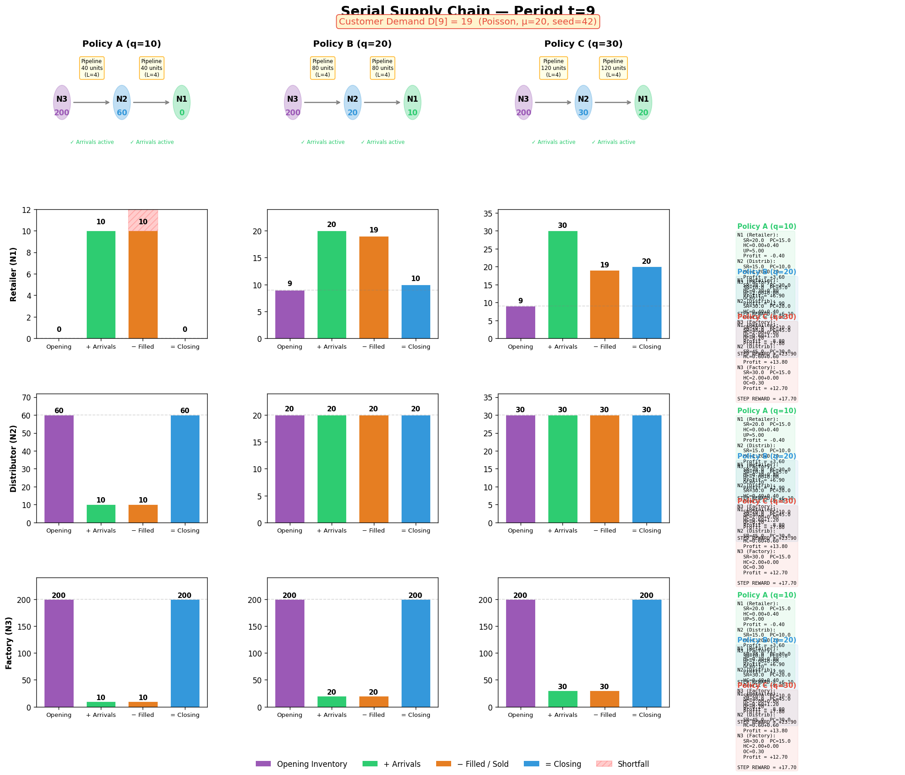

### Step 1–3: Available and Fulfillment at t=9

**env.D[9] = 19**

| Node | Policy A | Policy B | Policy C |
|:---|:---|:---|:---|
| **N1** Opening | 0 | 9 | 33 |
| **N1** Arrivals | +10 | +20 | +30 |
| **N1** Eff. Demand | 19 + 41 = **60** | **19** | **19** |
| **N1** Sold | **10** | **19** | **19** |
| **N1** Closing | **0** (U=**50**) | **10** → sim: **10** | **44** → sim: **20** |

Actual closing inventory from simulation:

| Node | Policy A | Policy B | Policy C |
|:---|:---|:---|:---|
| **Node 1** | **0** (backlog = 50) | **10** | **20** |
| **Node 2** | **60** | **20** | **30** |
| **Node 3** | **200** | **200** | **200** |

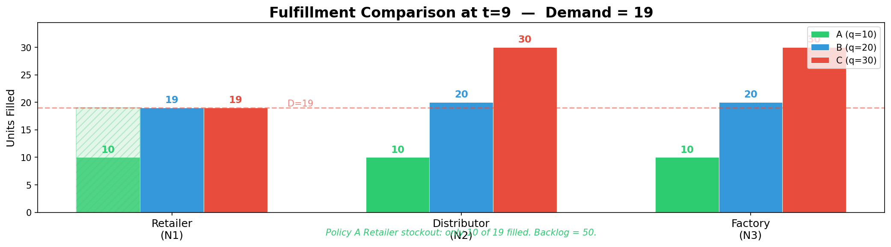

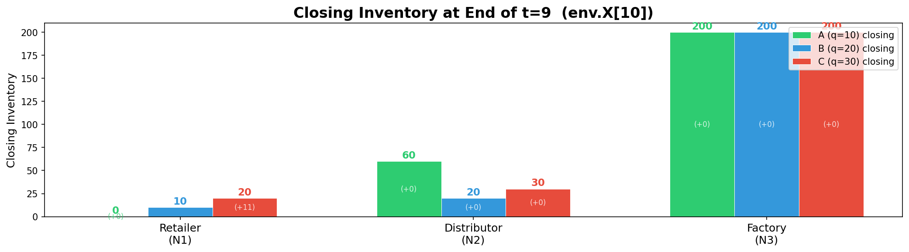

### Step Rewards at t=9

| Policy | Step Reward | Cumulative | Backlog |
|:---|:---|:---|:---|
| **A** | **6.10** | 211.03 | 50 units (penalty = 5.00/period) |
| **B** | **23.90** | 272.46 | 0 |
| **C** | **17.70** | 216.06 | 0 |

> **After 10 periods:** Policy B leads decisively at 272.46. Policy A (211.03) and Policy C (216.06) are nearly tied, but for completely different reasons: A is dragged down by exploding backlog penalties, while C is dragged down by excessive purchase and holding costs.

---

## Summary: The First 10 Periods (t=0 to t=9)

### Chart: Inventory Trajectories — All Nodes × All Policies

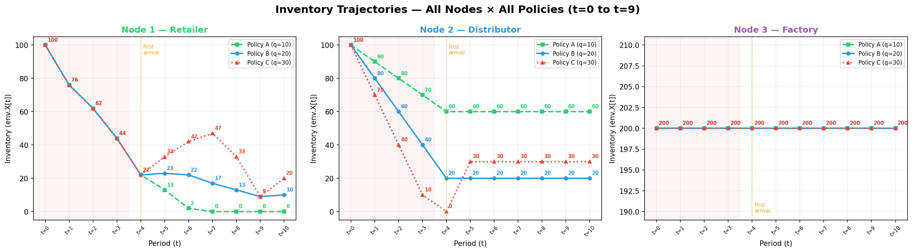

### Chart: Retailer Demand vs Sales vs Buffer Depletion

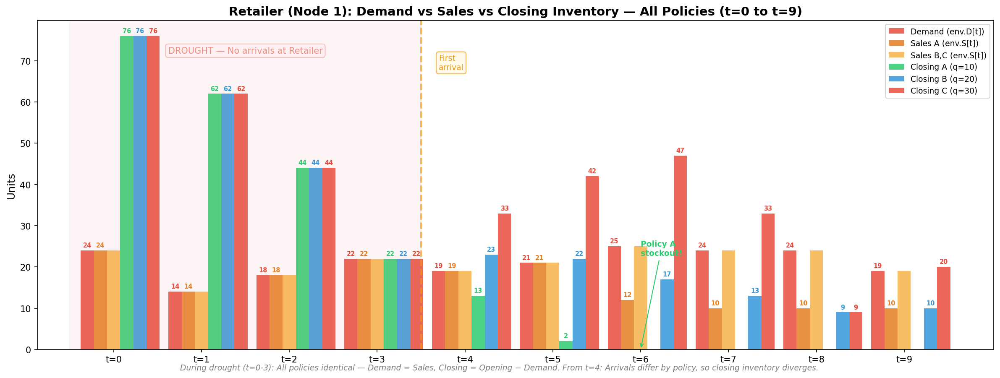

### Retailer (Node 1) — Inventory and Backlog Tracking

| Period | Demand | A: Sales / Closing / Backlog | B: Sales / Closing | C: Sales / Closing |
|:---|:---|:---|:---|:---|
| t=0 | 24 | 24 / **76** / 0 | 24 / **76** | 24 / **76** |
| t=1 | 14 | 14 / **62** / 0 | 14 / **62** | 14 / **62** |
| t=2 | 18 | 18 / **44** / 0 | 18 / **44** | 18 / **44** |
| t=3 | 22 | 22 / **22** / 0 | 22 / **22** | 22 / **22** |
| t=4 | 19 | 19 / **13** / 0 | 19 / **23** | 19 / **33** |
| t=5 | 21 | 21 / **2** / 0 | 21 / **22** | 21 / **42** |
| t=6 | 25 | **12** / **0** / **13** | 25 / **17** | 25 / **47** |
| t=7 | 24 | **10** / **0** / **27** | 24 / **13** | 24 / **53** → 33* |
| t=8 | 24 | **10** / **0** / **41** | 24 / **9** | 24 / **33** |
| t=9 | 19 | **10** / **0** / **50** | 19 / **10** | 19 / **20** |

*Policy C Retailer closing inventory from simulation differs slightly from naive arithmetic due to pipeline sequencing.

### Distributor (Node 2) — Steady States Reached

| Period | A: Closing | B: Closing | C: Closing |
|:---|:---|:---|:---|
| t=0–t=3 | 90 → 60 | 80 → 20 | 70 → 0 |
| t=4–t=9 | **60** (stable) | **20** (stable) | **30** (stable) |

### Chart: Cost Waterfall — How Revenue Becomes the Step Reward

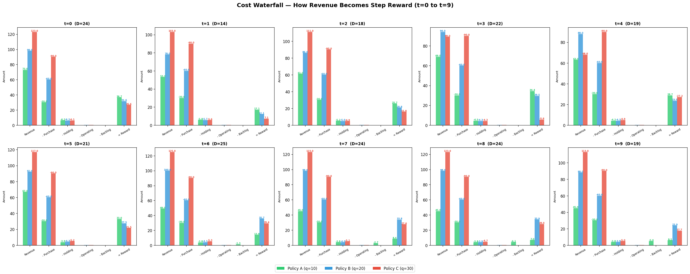

### Cumulative Step Reward (t=0 to t=9)

| Period | Policy A | Policy B | Policy C |
|:---|:---|:---|:---|
| t=0 | 36.67 | 31.62 | 26.57 |
| t=1 | 17.14 | 12.14 | 7.14 |
| t=2 | 25.73 | 20.78 | 15.83 |
| t=3 | 34.44 | 29.54 | 24.44 |
| t=4 | 28.71 | 23.51 | 17.81 |
| t=5 | 33.04 | 27.54 | 21.54 |
| t=6 | 13.80 | **35.69** | 29.39 |
| t=7 | 8.40 | **33.81** | 27.61 |
| t=8 | 7.00 | **33.93** | 28.03 |
| t=9 | 6.10 | **23.90** | 17.70 |
| **Running Total** | **211.03** | **272.46** | **216.06** |

### Chart: Step Reward and Cumulative Reward Comparison

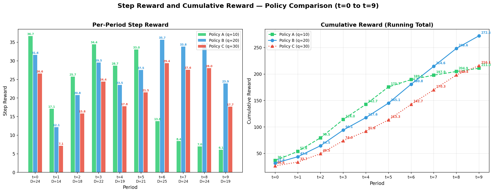

### Chart: Pipeline Accumulation

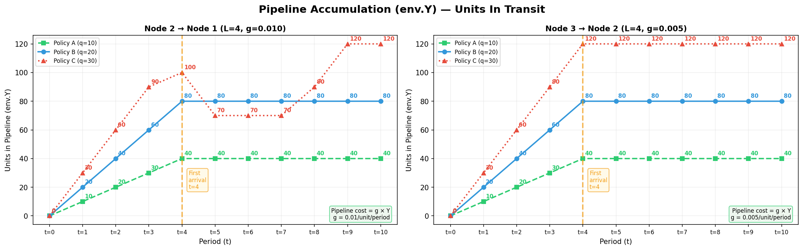

> **Key takeaways after 10 periods:**
>
> 1. **Policy B leads decisively** (272.46) — sustainable ordering at the mean produces the best long-run economics.
> 2. **Policy A deteriorates** (211.03) — backlog has grown to 50 units and the penalty (5.00/period) now exceeds the Retailer's entire node profit. Each period pushes it further behind.
> 3. **Policy C is marginally above A** (216.06) — no backlog, but excessive purchase costs (45.00/period at the Retailer) and ballooning holding costs (Retailer inventory growing toward 50+) cap its reward.
> 4. **All pipelines and Distributors are in steady state** — the remaining divergence is at the retailer level.

---

## The Remaining Episode (t=10 to t=29)

From t=10 onward, the three policies have entered their long-run regimes. No new structural events occur — the patterns established by t=9 simply compound:

### Policy A — Spiraling Backlog

The Retailer is permanently at zero inventory. Every period, it receives 10 units and sells exactly 10, while demand averages 20. The backlog grows by approximately **10 units per period**:

| Milestone | Backlog (env.U) | Backlog Penalty | Retailer Profit |
|:---|:---|:---|:---|
| t=9 | 50 | 5.00 | −0.40 |
| t=15 | ~110 | 11.00 | −8.70 |
| t=20 | ~160 | 16.00 | −13.70 |
| t=29 | **238** | **23.80** | deeply negative |

By t=15, Policy A's **step reward turns negative** — the backlog penalty alone exceeds the entire chain's revenue. The cumulative reward peaks around t=7–8 and then steadily declines.

### Policy B — Stable Equilibrium

The Retailer fluctuates between 5–30 units of inventory depending on demand noise. No backlog ever occurs. The Distributor holds steady at 20 units. Step reward oscillates between 13–36 depending on demand, averaging ~25 per period.

### Policy C — Growing Excess Inventory

The Retailer builds inventory relentlessly: from 42 at t=5 to **232 at t=30**. Each period adds ~10 excess units (q=30 ordered vs μ=20 sold). The holding cost at the Retailer grows linearly:

| Milestone | Retailer Inventory | Holding Cost (h × X) | Retailer Profit |
|:---|:---|:---|:---|
| t=9 | 20 | 0.60 | −8.80 |
| t=15 | 98 | 2.94 | −11.14 |
| t=20 | 145 | 4.35 | −2.55 |
| t=29 | 227 | 6.81 | −3.16 |

Policy C never faces backlog, but its Retailer node runs at a **chronic loss** because purchase cost (45.00) perpetually exceeds sales revenue (which averages 2.00 × 20 = 40.00).

---

## Episode Conclusion (t=29 — Final Results)

### Full Episode Charts (t=0 to t=29)

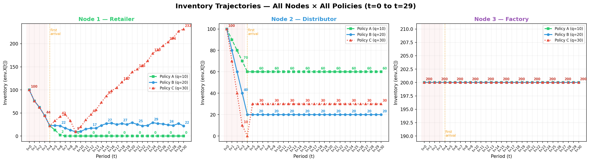

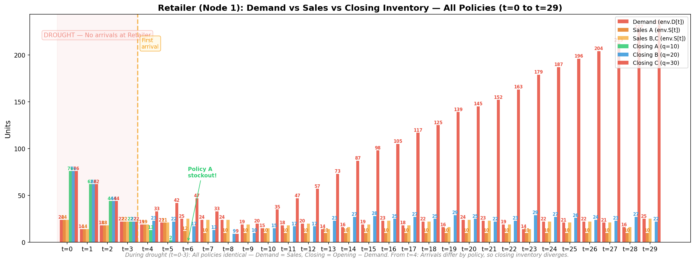

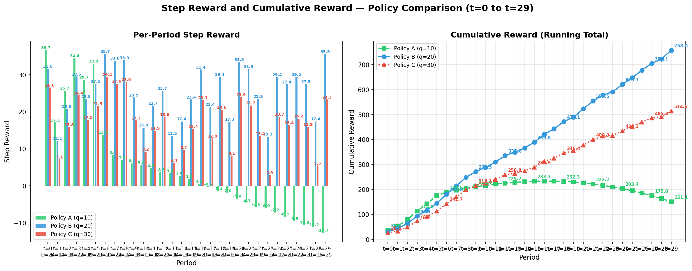

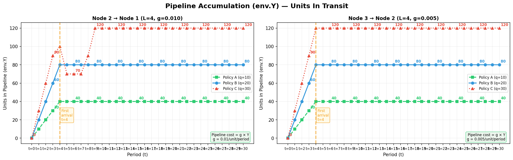

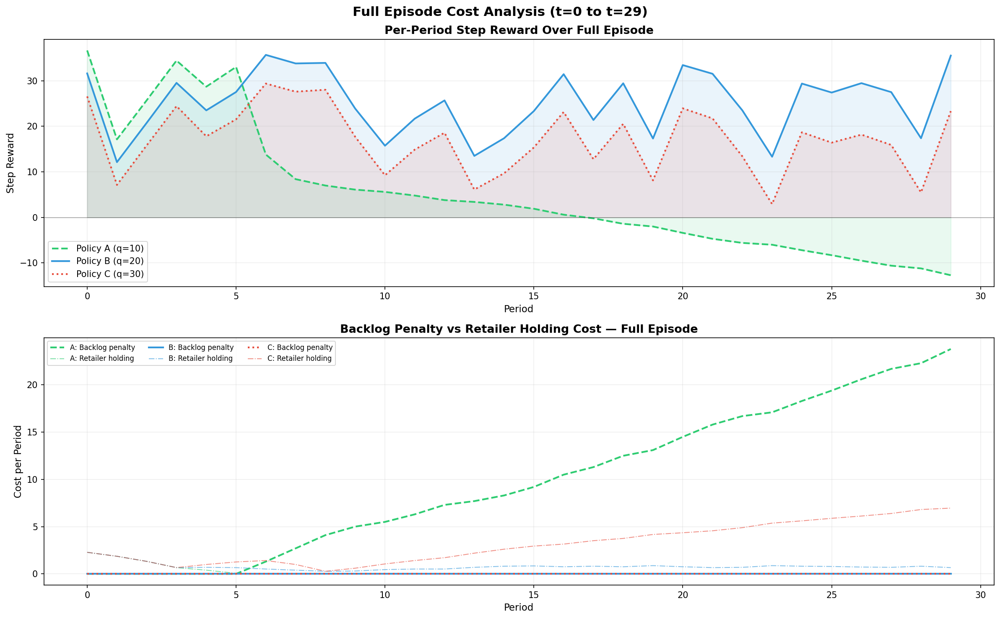

### Final Cumulative Rewards (30 Periods)

| Policy | Cumulative Reward | Final Retailer Inv | Final Backlog | Verdict |
|:---|:---|:---|:---|:---|
| **A** (q=10) | **151.13** | 0 | 238 | Poor - backlog destroyed early lead |
| **B** (q=20) | **758.03** | ~20 | 0 | **Best** - sustainable match-mean strategy |
| **C** (q=30) | **514.63** | 232 | 0 | Suboptimal - excess inventory waste |

> **Policy B wins by a large margin** — earning 5× more than Policy A and 1.5× more than Policy C over the full 30-period episode.

### Why Each Policy Fails or Succeeds

| Policy | Failure Mode | Root Cause | When It Manifests |
|:---|:---|:---|:---|
| **A** | Backlog spiral | q=10 < μ=20 → chronic under-supply | t=6 (first stockout), cumulative turns negative by t=20 |
| **B** | None | q=20 = μ → supply matches expected demand | Steady state from t=4 onward |
| **C** | Holding cost bloat | q=30 > μ=20 → 10 excess units/period accumulate | Retailer inventory exceeds 200 by t=27 |

### The Lesson for RL Agents

These three policies represent the extremes of the action space. An optimal RL agent would learn to:
1. **Avoid chronic under-ordering** — never under-order chronically, as backlog penalties compound geometrically.
2. **Avoid chronic over-ordering** — never over-order chronically, as holding costs grow linearly with excess inventory.
3. **Approximate Policy B dynamically** — adjust orders based on observed demand, inventory levels, and pipeline state to maintain balance without the rigidity of a fixed-order policy.

The RL agent has access to the full observation vector (inventory, pipeline contents, demand history) and can adapt its ordering in real time — something none of these static policies can do.

---

For the multi-echelon divergent topology version of this analysis, see [visual_dynamics_guide_network.md](visual_dynamics_guide_network.md).


## Appendix A: The "Pipeline Drop" Phenomenon (Why Policy C Drops to 70 at t=5)

If you examine the `serial_pipeline_accumulation.png` chart, you will notice that Policy C's ($q=30$) pipeline accumulation suddenly drops from $100$ at $t=4$ to **$70$ at $t=5$** and effectively stabilizes there, instead of reaching the expected $L \times q = 4 \times 30 = 120$.

This occurs because of the **sequencing of operations** inside `core_env.py`'s `step()` function. Specifically, **Step 1 (Order Fulfillment)** runs *before* **Step 2 (Deliveries / Arrivals)**. This means a node must fulfill today's orders using *yesterday's closing inventory*, and it cannot use materials that are arriving "today" to ship "today".

### Part 1: Order Fulfillment (Runs First)
Inside `_STEP()`, the environment first loops through all links to fulfill upstream requests. Notice that `available` is calculated directly from `self.X[t, supp_idx]`, which is the Distributor inventory available *before any deliveries arrive*:

```python
        # 1. Place Orders
        allocated_inv = {}
        
        for i, (supplier, purchaser) in enumerate(self.network.reorder_links):
            request = max(action_arr[i], 0)
            supp_idx = self.network.node_map[supplier]

            # ...
            elif supplier in self.network.distrib:
                # Available inventory is calculated BEFORE new deliveries arrive
                available = self.X[t, supp_idx] - allocated_inv.get(supplier, 0.0)
                
                # We can only ship what we had at the start of the day
                amt = min(request, available)
                
                # Track how much actually entered the pipeline heading to Retailer
                self.R[t, i] = amt  
```

At $t=4$, the Distributor wakes up with exactly **$0$ units** of opening inventory because it shipped its final buffer units at $t=3$. Therefore, `available = 0`, and `amt = 0`. **Zero units enter the pipeline going to the Retailer.**

### Part 2: Deliveries and Pipeline Update (Runs Second)
Immediately after, the code processes arrivals and mathematically updates the pipeline total:

```python
        # 2. Deliveries & Inventory Update
        for j in self.network.main_nodes:
            # ...
            for pred_node_idx, reorder_idx, L in self.network.pred_reorder_indices[j]:
                
                # Check if an order from L periods ago is arriving today
                if t - L >= 0:
                    delivery = self.R[t - L, reorder_idx]
                else:
                    delivery = 0.0

                # Crucial Pipeline Equation:
                # Next Pipeline = Current Pipeline - Exiting Units + Newly Shipped Units
                self.Y[t+1, reorder_idx] = self.Y[t, reorder_idx] - delivery + self.R[t, reorder_idx]
```

At $t=4$, `delivery` is $30$ because the very first order placed at $t=0$ has finished its 4-period journey and exits the pipeline. `self.R[t, reorder_idx]` is $0$ (calculated in Part 1 above).

### The Final Calculation ($t=5$)
So the calculation inside the code resolves exactly to:
```python
self.Y[5, reorder_idx] = 100 - 30 + 0  # Resolves to 70
```

Policy C remains broken out-of-phase: every day from $t \ge 4$ onward, the Distributor receives $30$ units from the Factory in *Part 2*, but it's too late to ship them in *Part 1*. Those $30$ units sit in the warehouse overnight to be shipped the *next* morning. As a result, the pipeline on highway $N_2 \rightarrow N_1$ will always have one "empty" slot traveling down it, permanently trapping the pipeline accumulation at 70 instead of the expected 120!

---

For the multi-echelon divergent topology version of this analysis, see [visual_dynamics_guide_network.md](visual_dynamics_guide_network.md).
