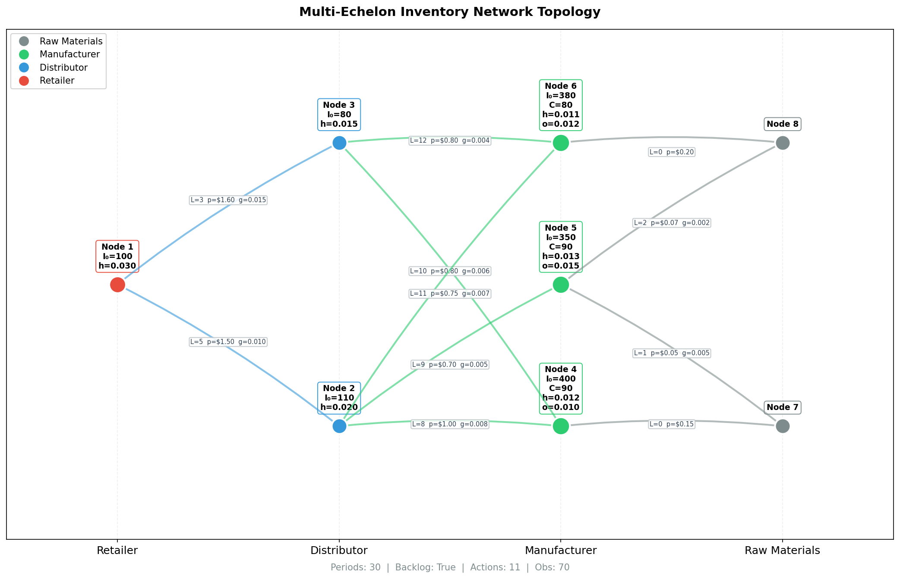
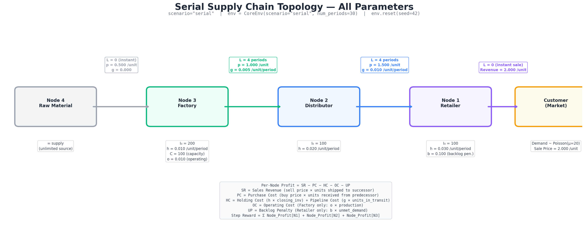

# Network Topologies

This document details the pre-built supply chain network configurations. For the mathematical formulation and how these parameters enter the reward function, see [mdp_formulation.md](mdp_formulation.md).

---

## Quick Reference: Parameter Definitions

Before the topology tables, here is what each column means:

### Node Parameters

| Column | Symbol | Meaning | Units |
|--------|--------|---------|-------|
| **I₀** | $I_0^{(j)}$ | Starting inventory when the episode begins | units |
| **h** | $h_j$ | Cost charged per unit of on-hand inventory per period | $/unit/period |
| **C** | $C_j$ | Maximum production throughput per period (factories only) | units/period |
| **o** | $o_j$ | Variable cost per unit produced (factories only) | $/unit |
| **v** | $v_j$ | Fraction of raw material that becomes finished product; 1.0 = no scrap | ratio ∈ (0,1] |

### Edge Parameters

| Column | Symbol | Meaning | Units |
|--------|--------|---------|-------|
| **L** | $L_e$ | Lead time — periods between placing an order and receiving it | periods |
| **p** | $p_e$ | Unit price: the **seller's revenue** and the **buyer's cost** per unit transacted | $/unit |
| **g** | $g_e$ | Pipeline holding cost: charged per unit *while in transit* per period | $/unit/period |
| **b** | $b_e$ | Backlog penalty: charged per unit of unmet customer demand per period | $/unit/period |

> **Key insight about `p`:** The same `p` parameter creates both revenue and cost. Retailer 1 **earns** $p = 2.00$ per unit sold to the market but **pays** $p = 1.50$ per unit ordered from distributor 2. This $0.50 gap is the gross margin.

---

## Multi-Echelon Divergent Network

**How to use:** `scenario='network'` or `scenario='base'`

> **Default configuration.** The topology below is the built-in default. All node parameters (I₀, h, C, etc.), edge parameters (L, p, g, b), and the supply relationships themselves can be modified by creating a [custom topology](#custom-topologies).

### Supply Relationships (Default)

The network is **divergent**: some suppliers serve multiple downstream customers, creating shared-capacity allocation decisions. The table below shows **who supplies whom** in the default configuration; each row is an edge in the graph with its lead time and price:

| Supplier → Customer | Lead Time (L) | Price (p) | What This Means |
|---------------------|:---:|:---:|-----------------|
| Raw 7 → Factory 4 | 0 | 0.150 | Instant raw material delivery |
| Raw 7 → Factory 5 | 1 | 0.050 | 1-period shipping delay |
| Raw 8 → Factory 5 | 2 | 0.070 | Factory 5 has **two** raw sources (7 and 8) |
| Raw 8 → Factory 6 | 0 | 0.200 | Instant delivery |
| Factory 4 → Distrib 2 | 8 | 1.000 | **Divergent**: Factory 4 serves both D2 and D3 |
| Factory 4 → Distrib 3 | 10 | 0.800 | Same factory, different customer, different L and p |
| Factory 5 → Distrib 2 | 9 | 0.700 | |
| Factory 6 → Distrib 2 | 11 | 0.750 | **Divergent**: Factory 6 also serves both D2 and D3 |
| Factory 6 → Distrib 3 | 12 | 0.800 | Longest lead time in the network |
| Distrib 2 → Retail 1 | 5 | 1.500 | Retail 1 has **two** suppliers (D2 and D3) |
| Distrib 3 → Retail 1 | 3 | 1.600 | Faster but more expensive than D2 |
| Retail 1 → Market 0 | — | 2.000 | Customer-facing; b = 0.10 backlog penalty |

### Network Diagram

Goods flow left → right; orders flow right → left. The image shows all node parameters (I₀, C, h) and edge parameters (L, p, g) on each connection:



**Why this topology is challenging:**
- **Shared capacity:** Factory 4 serves both distributors, so the agent must decide how to allocate Factory 4's C=90 capacity between them
- **Multiple sourcing:** Distributor 2 can order from three factories (4, 5, 6), requiring supplier selection
- **Asymmetric lead times:** The same factory can have different lead times to different customers (Factory 4: L=8 to D2, L=10 to D3)
- **Long pipelines:** Orders placed at the raw material level take up to 20+ periods to reach the market

### Node Parameters

| Node | Role | I₀ | h | C | o | v |
|------|------|:---:|:---:|:---:|:---:|:---:|
| 0 | Market | — | — | — | — | — |
| 1 | Retailer | 100 | 0.030 | — | — | — |
| 2 | Distributor | 110 | 0.020 | — | — | — |
| 3 | Distributor | 80 | 0.015 | — | — | — |
| 4 | Factory | 400 | 0.012 | 90 | 0.010 | 1.0 |
| 5 | Factory | 350 | 0.013 | 90 | 0.015 | 1.0 |
| 6 | Factory | 380 | 0.011 | 80 | 0.012 | 1.0 |
| 7 | Raw Material | — | — | — | — | — |
| 8 | Raw Material | — | — | — | — | — |

### Edge Parameters

| Edge | Direction | L | p | g | b |
|------|-----------|:-:|:---:|:---:|:---:|
| 1 → 0 | Retail → Market | — | 2.000 | — | 0.100 |
| 2 → 1 | Distrib → Retail | 5 | 1.500 | 0.010 | — |
| 3 → 1 | Distrib → Retail | 3 | 1.600 | 0.015 | — |
| 4 → 2 | Factory → Distrib | 8 | 1.000 | 0.008 | — |
| 4 → 3 | Factory → Distrib | 10 | 0.800 | 0.006 | — |
| 5 → 2 | Factory → Distrib | 9 | 0.700 | 0.005 | — |
| 6 → 2 | Factory → Distrib | 11 | 0.750 | 0.007 | — |
| 6 → 3 | Factory → Distrib | 12 | 0.800 | 0.004 | — |
| 7 → 4 | Raw → Factory | 0 | 0.150 | 0.000 | — |
| 7 → 5 | Raw → Factory | 1 | 0.050 | 0.005 | — |
| 8 → 5 | Raw → Factory | 2 | 0.070 | 0.002 | — |
| 8 → 6 | Raw → Factory | 0 | 0.200 | 0.000 | — |

### Profit Margins Per Echelon

To understand how `p` values create margins at each level:

| Node | Sells at (p) | Buys at (p) | Gross Margin |
|------|:---:|:---:|:---:|
| **Retail 1** | 2.000 (→ market) | 1.500 (← D2), 1.600 (← D3) | 0.40 – 0.50 per unit |
| **Distrib 2** | 1.500 (→ R1) | 0.70 – 1.00 (← F4/F5/F6) | 0.50 – 0.80 per unit |
| **Distrib 3** | 1.600 (→ R1) | 0.80 (← F4/F6) | 0.80 per unit |
| **Factory 4** | 0.80 – 1.00 (→ D2/D3) | 0.150 (← Raw 7) | 0.65 – 0.85 per unit |
| **Factory 5** | 0.700 (→ D2) | 0.050 – 0.070 (← Raw 7/8) | 0.63 – 0.65 per unit |
| **Factory 6** | 0.75 – 0.80 (→ D2/D3) | 0.200 (← Raw 8) | 0.55 – 0.60 per unit |

> **Note:** These are *gross* margins only. Net profit depends on holding costs ($h$), pipeline costs ($g$), operating costs ($o$), and backlog penalties ($b$).

### Space Dimensions

| Dimension | Value | How Computed |
|-----------|:-----:|-------------|
| Nodes | 9 | Total graph nodes |
| Main nodes | 7 | Distributors (2,3) + Factories (4,5,6) + Retailer (1) = 6, but code sorts `distrib + factory` = 6 managed + Retail 1 tracked for demand = 7 main |
| Reorder links | 11 | Edges with `L` attribute (all supply edges) |
| Retail links | 1 | Edges without `L` (1→0 only) |
| Max lead time | 12 | max(L) across all reorder edges |
| Pipeline length | 61 | sum(L) = 5+3+8+10+9+11+12+0+1+2+0 = 61 |
| **Action dim** | **11** | = number of reorder links |
| **Obs dim** | **70** | = 1 (demand) + 7 (inventory) + 60 (pipeline, excluding L=0 edges) + 2 (features) |

---

## Serial Supply Chain

**How to use:** `scenario='serial'`

> **Default configuration.** Like the multi-echelon network, this topology and all its parameters can be modified via [custom topologies](#custom-topologies).

### Supply Relationships (Default)

A linear chain — each node has exactly one supplier and one customer:

| Supplier → Customer | Lead Time (L) | Price (p) | Notes |
|---------------------|:---:|:---:|-------|
| Raw 4 → Factory 3 | 0 | 0.5 | Instant delivery |
| Factory 3 → Distrib 2 | 4 | 1.0 | 4-period shipping |
| Distrib 2 → Retail 1 | 4 | 1.5 | 4-period shipping |
| Retail 1 → Market 0 | — | 2.0 | b = 0.1 backlog penalty |

### Network Diagram



**Goods flow:** Raw 4 → Factory 3 → Distributor 2 → Retailer 1 → Market 0

This is the simplest multi-echelon topology — useful for baseline comparisons. No divergent branches, no shared capacity, no supplier selection.

### Node Parameters

| Node | Role | I₀ | h | C | o | v |
|------|------|:---:|:---:|:---:|:---:|:---:|
| 0 | Market | — | — | — | — | — |
| 1 | Retailer | 100 | 0.030 | — | — | — |
| 2 | Distributor | 100 | 0.020 | — | — | — |
| 3 | Factory | 200 | 0.010 | 100 | 0.010 | 1.0 |
| 4 | Raw Material | — | — | — | — | — |

### Edge Parameters

| Edge | Direction | L | p | g | b |
|------|-----------|:-:|:---:|:---:|:---:|
| 1 → 0 | Retail → Market | — | 2.0 | — | 0.1 |
| 2 → 1 | Distrib → Retail | 4 | 1.5 | 0.010 | — |
| 3 → 2 | Factory → Distrib | 4 | 1.0 | 0.005 | — |
| 4 → 3 | Raw → Factory | 0 | 0.5 | 0.000 | — |

### Profit Margins

| Node | Sells at | Buys at | Gross Margin |
|------|:--------:|:-------:|:-----------:|
| Retail 1 | 2.0 | 1.5 | 0.50 |
| Distrib 2 | 1.5 | 1.0 | 0.50 |
| Factory 3 | 1.0 | 0.5 | 0.50 |

### Space Dimensions

| Dimension | Value | How Computed |
|-----------|:-----:|-------------|
| Nodes | 5 | |
| Main nodes | 3 | Retailer (1) + Distributor (2) + Factory (3) |
| Reorder links | 3 | Edges 2→1, 3→2, 4→3 |
| Retail links | 1 | Edge 1→0 |
| Max lead time | 4 | max(4, 4, 0) = 4 |
| Pipeline length | 8 | 4 + 4 + 0 = 8 |
| **Action dim** | **3** | = reorder links |
| **Obs dim** | **15** | = 1 demand + 1 backlog + 3 inventory + 8 pipeline + 2 demand-engine features |

---

## Comparing the Two Topologies

| Property | Multi-Echelon | Serial |
|----------|:---:|:---:|
| Nodes | 9 | 5 |
| Action dimension | 11 | 3 |
| Observation dimension | 71 | 15 |
| Shared suppliers | Yes (F4, F6 serve two distributors) | No |
| Decision complexity | High (capacity allocation matters) | Low (linear decisions) |
| Bullwhip risk | High (divergent amplification) | Moderate |
| Max lead time | 12 periods | 4 periods |
| Cumulative pipeline | Up to 20 periods (raw → market) | 8 periods |

---

## Node Classification Rules

Nodes are classified automatically in `_compile_indices()` based on graph structure:

| Role | Classification Rule | What It Means |
|------|-------------------|---------------|
| **Raw Material** | Node has no predecessors | Unlimited supply source; orders always fully filled |
| **Factory** | Node has attribute `C` (capacity) | Produces goods; constrained by both inventory and capacity |
| **Distributor** | Node has `I0` but not `C` | Stores and forwards; constrained by inventory only |
| **Retailer** | At least one successor is a Market node | Customer-facing; subject to demand and backlog |
| **Market** | Node has no successors | Demand sink, not a "real" node — represents end customers |

The set **`main_nodes`** = sorted(Distributors ∪ Factories) — these are the nodes where inventory is tracked in the state.

---

## Visualization

```python
from gym_invmgmt import CoreEnv

# Multi-echelon network
env = CoreEnv(scenario='network')
env.plot_network()                         # Simple view
env.plot_network(detailed=True)            # With parameters on edges
env.plot_network(save_path='topology.png') # Save to file

# Serial chain
env = CoreEnv(scenario='serial')
env.plot_network(detailed=True)
```

---

## Defining Custom Topologies

The environment supports two ways to define network topologies:

### Approach 1: Built-in Presets

The two presets above (`network` and `serial`) are implemented as built-in Python presets inside `network_topology.py`. They're ready to use with no configuration:

```python
from gym_invmgmt import CoreEnv

env = CoreEnv(scenario='network')   # Divergent multi-echelon (9 nodes, 11 actions)
env = CoreEnv(scenario='serial')    # Linear chain (5 nodes, 3 actions)
```

These presets define every node attribute and edge parameter directly in the `_build_network_scenario()` and `_build_serial_scenario()` methods. They are useful for benchmarking and reproducible experiments.

### Approach 2: YAML Config Files

For custom topologies without modifying Python code, use a YAML config file:

```python
from gym_invmgmt import make_custom_env

env = make_custom_env('gym_invmgmt/topologies/diamond.yaml', num_periods=30)
obs, info = env.reset(seed=42)
```

Or equivalently:
```python
env = CoreEnv(scenario='custom', config_path='gym_invmgmt/topologies/diamond.yaml')
```

This approach is handled by the `_build_custom_scenario()` method, which:
1. Parses nodes and edges from the YAML file
2. Resolves distribution names (e.g. `"poisson"`) to scipy objects
3. Validates the graph structure
4. Auto-detects node roles and echelon levels

### YAML Schema Reference

```yaml
name: "My Custom Network"        # Optional
description: "..."                # Optional

nodes:
  - id: 0                        # Market (no attrs = demand sink)
  - id: 1                        # Retailer/Distributor
    I0: 100                      #   Initial inventory
    h: 0.030                     #   Holding cost per unit/period
  - id: 2                        # Factory (has C)
    I0: 200
    C: 100                       #   Production capacity/period
    o: 0.010                     #   Operating cost coeff
    v: 1.0                       #   Conversion factor
    h: 0.012
  - id: 3                        # Raw Material (no attrs, no predecessors)

edges:
  - from: 1                      # Retail edge → market
    to: 0
    p: 2.0                       #   Selling price (required)
    b: 0.1                       #   Backlog penalty (required)
    demand_dist: poisson         #   Distribution (required)
    dist_param: { mu: 20 }       #   Distribution params (required)
  - from: 2                      # Reorder edge → downstream
    to: 1
    L: 4                         #   Lead time in periods (required)
    p: 1.5                       #   Transfer price (required)
    g: 0.010                     #   Pipeline holding cost (required)
```

### Edge Types

| Edge Type | Required Attributes | How Detected |
|-----------|-------------------|-------------|
| **Retail** (to market) | `p`, `b`, `demand_dist`, `dist_param` | Target is a market node |
| **Reorder** (supply) | `L`, `p`, `g` | All other edges |

### Supported Demand Distributions

| YAML Name | scipy Object |
|-----------|-------------|
| `poisson` | `scipy.stats.poisson` |
| `normal` | `scipy.stats.norm` |
| `uniform` | `scipy.stats.uniform` |

### Validation

The parser automatically validates:
- OK Graph is a **connected DAG** (no cycles, single component)
- OK At least one market node and one raw material node
- OK All retail edges have `demand_dist`, `dist_param`, `p`, `b`
- OK All reorder edges have `L`, `p`, `g`
- OK Distribution names map to supported scipy distributions
- OK All edge references point to existing nodes

Action and observation dimensions scale automatically based on the graph structure.

### Available Topology Files

See [`gym_invmgmt/topologies/`](../gym_invmgmt/topologies/) for ready-to-use YAML templates:

| File | Topology | Description |
|------|---------|-------------|
| `serial.yaml` | RM → F → D → R → M | Equivalent to `scenario='serial'` |
| `divergent.yaml` | 2 RM → 3 F → 2 D → R → M | Equivalent to `scenario='network'` |
| `diamond.yaml` | RM → 2 F → R → M | New diamond topology with parallel factories |
